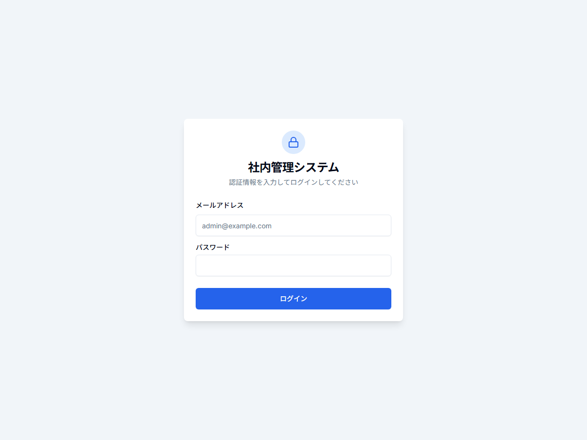
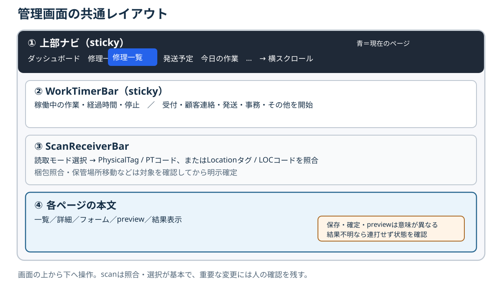

# 第4章 ログイン・画面構成・共通操作

## 4.1 管理画面へログインする

管理画面は`/login`からログインする。メールアドレスとパスワードを入力して「ログイン」を押す。認証に成功すると`/repairs`へ移動する。失敗時は画面のエラーを確認し、入力内容を見直す。画像中の`admin@example.com`は入力欄の**placeholder**であり、利用できる実アカウントを示していない。

認証はNextAuth Credentialsを使う。serverは`Admin`のメールアドレスで管理者を探し、保存済みpassword hashを照合する。session方式はJWTである。主要な管理画面routeにはNextAuth middlewareの認証境界があり、個別APIでもserver側で認証や管理者条件を再検証するものがある。**画面にボタンが見えることだけを操作権限の根拠にしない。**middlewareの対象外もあるため、全routeがmiddlewareだけで守られるとは扱わない。

> **共用PCでの制限:** 現行UIにはログアウトボタンも`signOut`操作も実装されていない。「画面からログアウトできる」と案内しない。共用PCで作業を離れるときは、認証済み画面を他者が操作できる状態で放置しない。現行UI内でログアウトできないため、共用端末のセッション終了方法は別途運用ルールを定める必要がある。ログアウト機能が追加されたら、この節と画面画像を更新する。

## 4.2 ログイン後の共通レイアウト

認証後のアプリ画面は上から、横方向のナビゲーション（`Sidebar`）、共通業務タイマー（`WorkTimerBar`）、タグ読取欄（`ScanReceiverBar`）、各ページ本文の順に並ぶ。ナビは画面上端に固定され、タイマーバーはその下に固定される。読取欄はその下に表示される。

ナビは横スクロールできる。現在のページに対応する項目は**青色**で表示される。画面幅が狭く項目が見切れるときは、ナビを横へスクロールして探す。

## 4.3 上部ナビの主な行き先

| 用途 | 現行のナビ項目 |
| --- | --- |
| 概況と案件 | ダッシュボード、修理一覧、ボード表示、新規修理登録、お問い合わせ |
| 現場と発送 | 保管場所、発送予定、今日の作業、作業カレンダー |
| 部品・設定・管理 | 部品マスタ、発注管理、料金マスタ、スケジューラ設定、請求書管理、顧客管理、LINEユーザー |

ナビは各機能への入口である。ページによって保存・確定・プレビューの意味が異なるため、画面内の状態表示と確認文言を読んでから実行する。

## 4.4 共通業務タイマー

タイマーバーは、稼働中の業務種別、必要に応じた作業名、経過時間、**停止**ボタンを示す。停止中はその状態を表示する。共通業務のクイック開始には「受付」「顧客連絡」「発送」「事務」「その他」がある。Repairなど特定対象の作業タイマーとは入力の入口が異なるので、計測対象を確かめて開始する。エラー時は表示を読み、必要に応じて「再取得」で現在状態を確認する。詳しくは[第13章](13_work-time-session.md)を参照する。

## 4.5 共通のタグ読取欄

読取モードを先に選び、USBリーダーの入力または手入力で照合する。通常の入力欄は`PhysicalTag / PTコード`を受け付ける。保管場所移動・棚卸しでは、先に移動先または棚卸し先の`Locationタグ / LOCコード`を指定し、その後に対象のPhysicalTagを読む。主なモードは案件を開く、作業タイマー、一括選択、納品書対象、発送対象、梱包照合、保管場所移動、保管場所棚卸しである。

読取は対象の**照合・選択**が基本であり、scanだけで重要な状態変更を確定しない。たとえばタイマーは候補を見て開始・切替を確認し、Shipmentは選択一覧を見て作成ボタンを押す。梱包照合は既存Shipmentの内容と読取結果を確認し、PhysicalTagの割当解放にはさらに対象プレビューと明示操作が必要である。保管場所移動も移動先と対象を確認してから確定する。棚卸し結果の確認はread-onlyである。詳細は[第17章](17_scan-session.md)以降の各業務章を参照する。

> **保守注記:** Root layoutには旧形式の`/repairs/{id}` URLを検出して画面遷移する`QRScannerListener`も残る。PhysicalTagの現行正本運用はScanSessionとPhysicalTag resolverであり、旧URL shortcutと同一視しない。

## 4.6 保存・確定・プレビュー・通知の読み分け

| 表示・操作 | 意味を確認する点 |
| --- | --- |
| 保存 | 入力がアプリに記録されたか。外部送信や実発送まで終わったとは限らない |
| 確定・送信 | 対象と結果を確認する。LINEの送信待ちintentや外部履歴照合など、後続の確定段階がある |
| scan・照合 | 識別・候補選択・一致確認。別の確定操作が必要な場合がある |
| preview | 内容確認。特にread-only previewはDBの状態を更新しない |

処理後に応答が見えない場合、同じボタンを連打しない。先に一覧・詳細・対象の状態を再確認する。画面共通のtoastなどの通知は操作結果の手がかりになるが、外部送信や入金・引受の最終証拠とは分ける。正本と状態の確認は[第35章](35_status-source-of-truth.md)、二重送信・二重作成を防ぐ手順は[第36章](36_duplicate-safety.md)を参照する。
