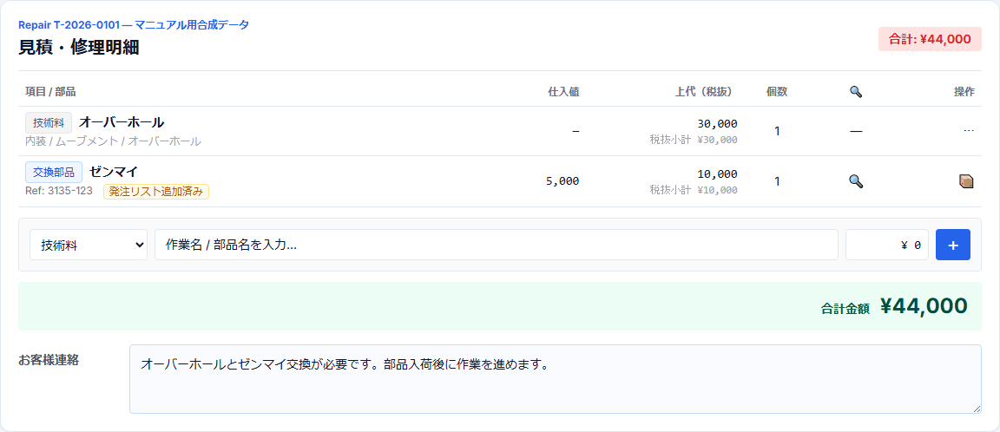
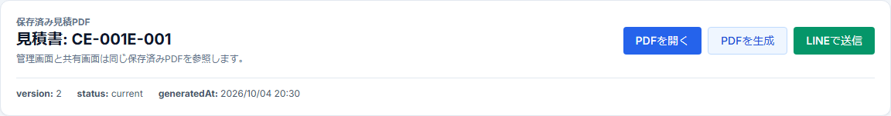

# 第9章 修理明細・見積作成

## 9.1 見積工程の入口

現物受付後、時計の状態を確認し、必要な作業・部品・価格をRepairへ入力する。

現在のB2C基本フローでは、`送付待ち → 受付` の直後はまず `受付` のままにする。その後、見積明細が入った状態でRepairを保存すると、通常は `見積中` へ進む。

```text
送付待ち
  ↓ 現物到着
受付
  ↓ 状態確認・見積明細入力
見積中
  ↓ 見積書作成・PDF確認
LINE共有
  ↓ 実送信確認
承認待ち
```

`受付` と `見積中` は、現物受領と見積作業を区別するための別状態である。

## 9.2 「見積・修理明細」の役割

Repair詳細の「見積・修理明細」で、顧客へ提示する作業と部品を構造化して入力する。

現在の主な明細区分は次の3種類。

- 技術料 — 内装作業等のLABOR
- 外装修理技術料 — 外装作業のLABOR
- 交換部品 — PART

内装・外装の作業マスタと部品マスタは役割が異なるため、同じものとして扱わない。



## 9.3 明細行で確認する項目

既存明細行では主に次を確認・編集できる。

- 項目 / 部品
- 仕入値
- 上代（税抜）
- 個数
- 部品検索
- 発注連携
- 備考 / 仕様

交換部品では、紐付いたPartsMaster情報に応じて次の情報も表示される。

- 部品Ref
- Cousins番号
- 在庫 / 注文 / 入荷等の状態

## 9.4 技術料を追加する

技術料では、必要に応じて「詳細な作業分類」を開き、構造化情報を指定する。

主な入力:

1. 作業カテゴリ
2. 対象部品
3. 処置
4. detail
5. 顧客向け表示名 / 作業名
6. 上代
7. 備考

内装LABORと外装LABORでは使用するマスタ契約が異なる。

### 内装

内装作業はmovement Calを中心に扱う。

価格候補は現在の正本ルールに従い、主に次の優先順でCal情報を参照する。

1. movementCaliber
2. baseMovementCaliber
3. Watchの登録Cal

### 外装

外装修理技術料は、ブランド / モデル / 対象部品 / 処置 / detailを中心に構造化する。

外装LABORでPartsMasterを対象部品マスタとして使わない。対象部品名はPartNameMaster側の標準部品名で扱う。

## 9.5 交換部品を追加する

交換部品では、まず部品カテゴリと標準部品名を選択し、必要に応じてPartsMasterの実部品へ紐付ける。

- PartNameMaster — 標準的な「部品名」のマスタ
- PartsMaster — 実際の部品、在庫、仕入先、価格、Ref等を扱うマスタ

この2つは別の役割である。

部品行の検索ボタンから部品パネルやWeb検索へ進み、時計のブランド / Ref / Cal / 標準部品名等に合う候補を確認する。

適合しない候補を無理に紐付けず、現物・部品Ref等を確認する。

## 9.6 金額計算

見積画面では各明細の上代（税抜）×個数を合計する。

```text
税抜小計 = Σ（上代 × 個数）
消費税 = floor(税抜小計 × 10%)
税込合計 = 税抜小計 + 消費税
```

画面の「合計金額」は税込合計を表示する。

## 9.7 お客様連絡

Repair詳細の「お客様連絡」には、見積内容に添えて顧客へ説明したい事項を入力する。

例:

- 故障原因の説明
- 交換が必要な理由
- 修理上の注意点
- 外観変化の可能性
- 部品供給上の制約

この欄は顧客共有ページの説明や見積書の連絡事項に利用される。

内部判断だけのメモは「社内メモ」へ分ける。

## 9.8 Repairを保存する

見積明細を入力したらRepairを保存する。

現行ロジックでは、通常の `受付` Repairに見積明細がある状態で保存すると `見積中` へ進む。

ただし、現物到着時の `送付待ち → 受付` そのものは、既存見積明細があっても一度 `受付` として確定する。現物受領と見積開始を同一操作にしないためである。

## 9.9 見積書を作成する

正式な見積書はRepair一覧から対象案件を選択して作成する。

1. 修理一覧を開く。
2. 見積書へ含めるRepairをチェックする。
3. 「見積書作成」を押す。
4. EstimateDocumentが作成される。
5. 1件の見積書が作成された場合は見積書画面へ移動する。

同一顧客の複数Repairを1つの見積書へまとめることもできる。


## 9.10 EstimateDocumentとPDFは別

「見積書作成」でEstimateDocumentを作っただけでは、保存済みPDFがまだ存在しない場合がある。

見積書画面で次の順に確認する。

1. 「PDFを生成」
2. 保存済みPDFを生成
3. 「PDFを開く」
4. 内容を確認
5. 問題なければ「LINEで送信」



## 9.11 保存済みPDFを正本にする理由

現在の見積PDFは、管理画面で確認するPDFと顧客共有ページから開くPDFが同じ保存済みファイルを参照する。

```text
EstimateDocument.currentPdfFileId
  ↓
EstimatePdfFile
  ↓
storageKey
  ↓
Supabase Storage / documents bucket
```

PDFを再生成した場合は新しい版がcurrentになり、旧版は履歴側へ残る。

これにより「管理画面で確認した内容と、顧客が開いたPDFが違う」という事故を防ぎやすくしている。

## 9.12 LINEで送るもの

正式な見積LINE送信ではPDFファイルを直接添付しない。

LINEで送るのは、顧客用の見積共有ページURLである。

共有ページから顧客は次を確認できる。

- 時計情報
- 見積明細
- 税抜小計 / 消費税 / 税込合計
- 説明文
- 保存済み見積PDF
- 承認操作
- LINE相談導線

## 9.13 「LINEで送信」の時点では送信完了ではない

見積書画面の「LINEで送信」は、現在の安全送信基盤へ送信intentを登録する操作である。

```text
管理画面で「LINEで送信」
  ↓
LineManagerSendOutbox = APPROVED
  ↓
ローカルsenderがclaim
  ↓
lineoa / LINE Managerで送信
  ↓
送信履歴を照合
  ↓
CONFIRMED
```

`APPROVED` は「送信してよいintent」であり、「顧客へ届いたことを確認済み」という意味ではない。

## 9.14 承認待ちへ進むタイミング

Repairを `承認待ち` へ進めるのは、見積共有メッセージがLINE Managerの履歴で確認され、OutboxがCONFIRMEDになった後である。

その際、システムは見積書・顧客・Repair構成・元Inquiry・verified chat等を再検証する。

条件が変わっていた場合は、古い送信結果を根拠に無理にstatusを進めない。

現在の対象statusは主に次の2つ。

- `受付`
- `見積中`

正常に実送信確認できた場合のみ、該当Repairを `承認待ち` へ遷移する。
