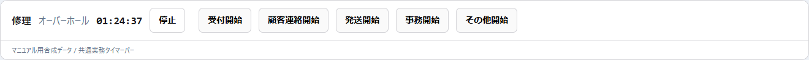
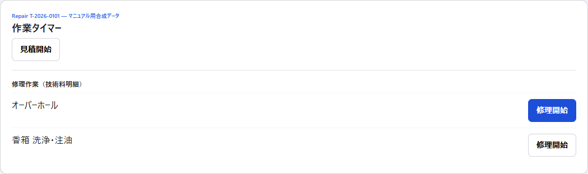

# 第13章 WorkTimeSessionと共通業務タイマー

## 13.1 目的

WorkTimeSessionは、修理・見積・受付・問い合わせ・発注・発送など、実際に何分かかったかを開始時刻と終了時刻で保存する実績計測基盤である。

単なる画面上のストップウォッチではなく、Schedulerの推定時間・業務予約時間・将来の実績学習へ使う正本データを蓄積する。

## 13.2 計測できる活動区分

| activityType | 画面表示 | 主な開始場所 |
| --- | --- | --- |
| REPAIR | 修理 | Repair詳細 / 今日の作業 |
| ESTIMATE | 見積 | Repair詳細 |
| INTAKE | 受付 | 共通タイマーバー |
| INQUIRY | 問い合わせ対応 | Inquiryレビュー |
| CUSTOMER_CONTACT | 顧客連絡 | 共通タイマーバー |
| PARTS_ORDER | 発注作業 | 発注管理 |
| SHIPPING | 発送 | 共通タイマーバー |
| ADMIN | 事務 | 共通タイマーバー |
| OTHER | その他 | 共通タイマーバー |

## 13.3 同時に計測できるのは1件だけ

アプリ全体でactiveなWorkTimeSessionは最大1件である。

新しいタイマーを開始すると、現在動いているタイマーを終了して新しいsessionへ切り替える。

```text
修理A 計測中
  ↓ 別の作業を開始
修理A sessionを終了
  ↓
新しい作業 sessionを開始
```

複数画面で同時に別々のタイマーを動かす設計ではない。

## 13.4 共通業務タイマーバー

管理画面上部には共通タイマーバーが常駐する。



active sessionがある場合は次を表示する。

- 活動区分
- 作業label
- 経過時間 `HH:MM:SS`
- 停止ボタン

active sessionがない場合は「タイマー停止中」と表示する。

## 13.5 クイック開始

共通タイマーバーから直接開始できる業務:

- 受付
- 顧客連絡
- 発送
- 事務
- その他

これらは特定Repair / Inquiry / OrderRequestへ紐付けない共通業務として計測する。

## 13.6 Repair詳細からの計測

Repair詳細には「作業タイマー」パネルがある。



### 見積

`見積開始` で `ESTIMATE + repairId` を開始する。

### 修理

技術料のLABOR明細ごとに `修理開始` を表示する。

開始時には、対象Repairと作業labelをsnapshotとして保存する。

PART明細は修理タイマーの対象ではない。

## 13.7 RepairLineItem IDへ強く依存しない理由

RepairLineItemは保存時の再生成等でIDを永続的な業務識別子として扱いにくい。

そのためWorkTimeSessionは、計測開始時点の作業条件を `contextSnapshot` として保持する。

- 作業カテゴリ
- 対象部品
- 処置
- 詳細label等

の開始時点情報を履歴として残し、後から明細行が変わっても実績の意味を失いにくくする。

## 13.8 Inquiry / 発注管理からの開始

### Inquiry

受付レビューの「問い合わせ対応開始」から `INQUIRY + inquiryId` を計測する。

### OrderRequest

発注管理の「発注作業開始」から `PARTS_ORDER + orderRequestId` を計測する。

Repairに紐づくOrderRequestではrepairIdも一緒に保持する。

## 13.9 停止

共通タイマーバーの「停止」を押すと現在のactive sessionを終了する。

active sessionがない状態で停止要求が来ても、新しいデータを作らず `stopped: false` として扱う。

## 13.10 秒精度で保存する

開始・終了時刻は秒精度で保存する。

画面でも経過時間は1秒ごとに更新する。

Schedulerや統計で利用するときは必要に応じて分単位へ集計する。

## 13.11 画面を移動してもタイマーは継続する

WorkTimerProviderはアプリ共通layout配下にあり、ページ遷移だけでsessionを終了しない。

ブラウザがfocusへ戻った時はactive sessionを再取得する。

そのため別タブ・別画面で操作した後も、現在の正本状態へ再同期する。

## 13.12 二重操作の防止

開始・停止処理中は追加操作をdisableする。

同じ対象がすでに計測中の場合、開始ボタンは「計測中」となり再開始できない。

DB側でもactive session全体1件の制約とtransaction lockを持ち、画面だけに依存していない。

## 13.13 同じlabelのLABOR明細

現行WorkTimeSessionはRepairLineItem IDを永続保存しない。

そのため同じRepair内に表示labelが完全一致する複数LABOR行がある場合、UI上の「同じ作業を計測中」判定では区別できないことがある。

同名の技術料を複数行作る必要がある場合は、作業labelが区別できる構造化入力を優先する。

## 13.14 修正・無効化

backendには終了済みsessionの時刻修正・無効化APIがある。

- 修正には理由が必要
- 無効化にも理由が必要
- 最初の修正前時刻をoriginalStartedAt / originalEndedAtとして保持

ただし、現行の日常操作UIには履歴一覧・時刻修正・invalidate画面はまだ常設していない。

マニュアル上、通常作業で直接DBを編集しない。

## 13.15 ScanSessionとの関係

PhysicalTagのTIMER scanは、scanしただけで即タイマーを開始・切替しない。

```text
PhysicalTagをscan
  ↓
Repairを解決
  ↓
対象を人が確認
  ↓
開始 / 切替
```

現物を読んだ瞬間に誤ったsessionへ切り替わることを防ぐため、人間確認を残している。

ScanSessionの詳細は第17章で扱う。

## 13.16 タイマー障害時

通信失敗時はエラーを表示し、active状態を推測して続行しない。

「再取得」でサーバー側のactive sessionを読み直す。

タイマー表示が不明なまま開始ボタンを何度も押さず、まず再取得して現在状態を確認する。

## 13.17 実務上の使い方

基本運用:

1. 作業を始める直前にタイマー開始。
2. 別作業へ移る場合は新しい作業を開始してswitch。
3. 休憩・作業終了時は停止。
4. Repair作業は可能な限り該当LABOR明細から開始。
5. 発注・問い合わせ等は専用導線を使う。

正確な実績を蓄積するほど、後続の標準時間・推奨時間・業務予約容量の判断材料が増える。
