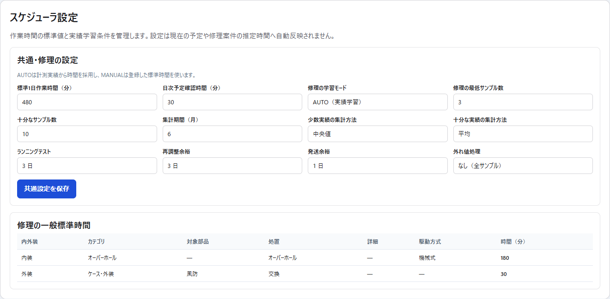
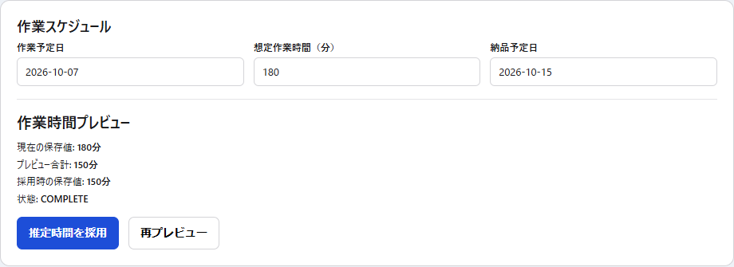

# 第14章 Scheduler設定・標準作業時間・実績学習

## 14.1 Scheduler設定画面

Schedulerの設定は `/settings/scheduler` で管理する。



この画面は「値を保存した瞬間に既存予定を全部書き換える」ための画面ではない。

設定・標準時間・実績feedbackを確認し、必要な値を人が明示保存する。

## 14.2 WorkCalendarとの役割分担

SchedulerSettingの `standardDailyMinutes` と、WorkCalendarの1日容量は別の概念である。

現行運用ではWorkCalendarの通常日を480分として扱い、休み・半日等の例外をWorkCalendarへ登録する。

SchedulerSettingの「標準1日作業時間」を変更しても、既存WorkCalendarの通常日容量を自動変更しない。

一方、日次予定確認時間や共通業務の予約時間は、納期・容量previewで実効作業容量から差し引く。

```text
WorkCalendar総容量
 - 日次予定確認時間
 - 共通業務の日次予約時間
 = Repairへ使える実効容量
```

## 14.3 共通・修理の設定

主な設定:

- 標準1日作業時間（分）
- 日次予定確認時間（分）
- 修理の学習モード AUTO / MANUAL
- 修理の最低サンプル数
- 修理の十分なサンプル数
- 修理の集計期間（月）
- 少数実績の集計方法
- 十分な実績の集計方法
- 外れ値処理
- ランニングテスト日数
- 再調整余裕日数
- 発送余裕日数

設定は `共通設定を保存` で保存する。

## 14.4 AUTOとMANUAL

### AUTO

計測実績が条件を満たした場合に実績値を採用する。

### MANUAL

登録した一般標準時間を採用する。

AUTOでも、最低サンプル数へ届くまでは実績を採用しない。

実績が少ない期間と十分に蓄積した期間で、中央値・平均・P80等の採用方法を分けられる。

## 14.5 集計方法

現在選べる集計方法:

- 平均（MEAN）
- 中央値（MEDIAN）
- 80パーセンタイル（P80）

P80は「多くの実績がこの時間内に収まる側」へ余裕を持たせたい場合の参考値として利用できる。

どの値を採用するかはSchedulerSettingを正本とし、コードへ固定しない。

## 14.6 外れ値処理

修理実績には外れ値処理を設定できる。

- NONE — 全サンプルを使う
- IQR — 四分位範囲から外れる極端な値を除外する

タイマーの押し忘れ等で極端に長い実績が混ざった場合の影響を抑えるための設定である。

## 14.7 修理以外の業務設定

次の活動区分ごとに設定を持つ。

- 見積
- 受付
- 問い合わせ
- 顧客連絡
- 部品発注
- 発送
- 事務
- その他

主な項目:

- 手動標準時間（分）
- 日次予約時間（分）
- 学習モード
- 集計方法
- 集計期間
- 代替集計期間
- 最低サンプル数

空欄の手動標準時間は「0分」ではなく「未設定」である。

## 14.8 AUTO学習に対応する共通業務

現行でAUTO学習に対応する区分:

- ESTIMATE（見積）
- INQUIRY（問い合わせ）
- PARTS_ORDER（部品発注）

その他の区分はMANUAL運用を基本とする。

## 14.9 日次予約時間

日次予約時間は「1件の標準時間」ではない。

1日のRepair容量から、問い合わせ・見積・事務等のために先に確保する時間である。

例:

```text
総容量 480分
予定確認 30分
問い合わせ予約 60分
事務予約 20分
  ↓
Repair実効容量 370分
```

実績が蓄積すると、現在の予約時間と日別実績を比較するread-only feedbackを確認できる。

feedbackを見ただけでは予約時間を自動変更しない。

## 14.10 修理の一般標準時間

`RepairWorkTimeStandard` は、実績が不足している場合に使う一般条件の標準時間である。

条件:

- 内装 / 外装
- 作業カテゴリ
- 対象部品名（任意）
- 処置（任意）
- 詳細label（任意）
- 駆動方式（内装のみ）
- 標準作業時間（分）

初期状態で推測値を一括seedしておらず、必要な標準時間を実務確認しながら登録する。

## 14.11 内装と外装を混ぜない

標準時間入力でも内装 / 外装の分類を維持する。

外装では駆動方式を条件に使わない。

対象部品は `PartNameMaster` の標準部品名であり、在庫実部品の `PartsMaster` ではない。

標準時間登録のために実部品在庫マスタを流用しない。

## 14.12 標準時間の編集

既存行は一覧から「編集」を選ぶ。

不要になった行は「削除」で明示確認後に削除する。

同一条件の重複行はDB側でも拒否する。

## 14.13 Repairごとの作業時間プレビュー

Repair詳細の「作業スケジュール」には作業時間プレビューがある。



表示例:

- 現在の保存値
- プレビュー合計
- 採用時の保存値
- previewStatus
- 未解決の作業単位
- 未構造化の技術料

`COMPLETE` かつ保存可能な正の整数分である場合のみ「推定時間を採用」を実行できる。

## 14.14 推定時間の採用は人が行う

プレビュー値が算出されても、自動で `estimatedWorkMinutes` を上書きしない。

```text
構造化Repair明細
 + 標準時間 / 実績
  ↓
作業時間プレビュー
  ↓ 人が確認
「推定時間を採用」
  ↓
estimatedWorkMinutesを更新
```

Scheduler v2が予定計算に使うのは、現在保存されている推定時間または残作業時間である。

## 14.15 実績優先の考え方

修理時間のresolverは、設定された学習モード・サンプル数・集計条件に従って採用値を決める。

十分な実績がない場合は一般標準へfallbackする。

実績件数が揃った後に、中央値・平均・P80等へ切り替える。

「1件だけ速かったから標準を即変更する」といった挙動にはしない。

## 14.16 Scheduler v2上の時間feedback

Scheduler v2では保存済み推定時間に対して、実績から得られる推奨値を参考表示する。

例:

```text
保存 180分
推奨 150分
差分 -30分
根拠: 実績中央値 / 有効サンプル数
```

この推奨値はSchedulerの予定案へ自動採用しない。

案件詳細で確認し、「推定時間を採用」して保存値が更新されてから予定計算へ反映する。

## 14.17 容量feedback

Scheduler設定画面では、WorkTimeSession実績と現在の予約容量をread-onlyで比較できる。

実績日がない日を0分として平均へ混ぜない。

「計測した日」の観測値として扱う。

## 14.18 納期feedback readiness

現在は次のデータ状況を確認できる。

- runningTestDays
- reworkBufferDays
- shippingBufferDays
- Repair総件数
- 納品予定日あり件数
- 実納品日あり件数
- 両方あり件数

ただし、現時点では信頼できるcanonical actual event timestampが不足しているため、遅延日数・納期遵守率・原因別buffer推奨値を自動計算しない。

## 14.19 工程buffer

納期逆算では、次の3項目がすべて設定済みの場合に工程bufferとして扱う。

- ランニングテスト日数
- 再調整余裕日数
- 発送余裕日数

空欄は未設定、`0` は明示的な0日である。

暗黙の3日 / 3日 / 1日等へfallbackしない。

## 14.20 設定を変更しても既存予定は自動変更しない

Scheduler設定・標準時間を変更しても、既存のRepair予定や推定時間を無確認で一括更新しない。

変更後は必要に応じて:

1. Repair作業時間を再プレビュー。
2. 推定時間を人が採用。
3. Scheduler v2予定案を再取得。
4. 内容を確認。
5. 明示的に反映。

という段階を踏む。

## 14.21 日常運用で変更頻度が低い項目

次は毎日触る設定ではない。

- サンプル閾値
- 集計方法
- 集計期間
- 外れ値処理
- 標準時間マスタ
- 工程buffer

通常業務ではタイマー実績を蓄積し、一定期間ごとにfeedbackを見て設定を見直す。
