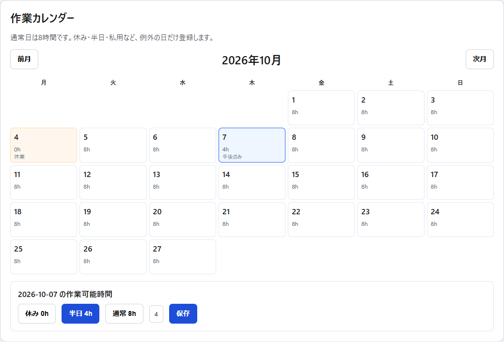
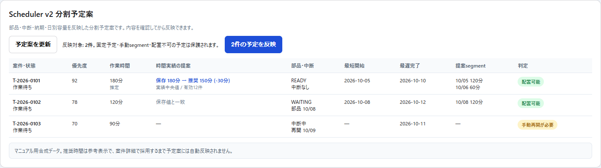
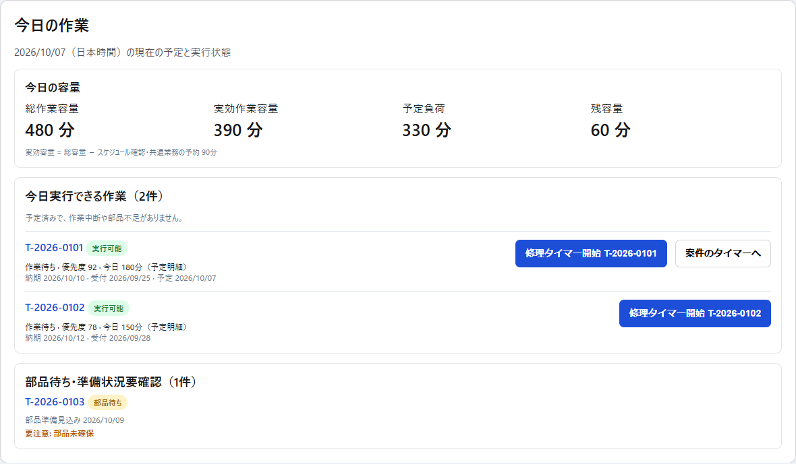

# 第15章 WorkCalendar・Scheduler v2・今日の作業

## 15.1 Scheduler全体像

現在のSchedulerは、1つの自動ボタンだけで全案件を勝手に確定する設計ではない。

主な構成:

```text
WorkCalendar
  ↓ 1日の総容量
Scheduler設定
  ↓ 予定確認・共通業務予約・工程buffer
Repair
  ↓ status / 納期 / 推定時間 / priority
Parts readiness / PlanningState
  ↓ 作業可能判定
Deadline / Capacity preview
  ↓
Scheduler v2 分割予定案
  ↓ 人が確認して反映
RepairScheduleSegment
  ↓
今日の作業
```

## 15.2 WorkCalendar

`/repairs/calendar` の作業カレンダーでは、1日の作業可能時間を管理する。



通常日は8時間（480分）。

例外の日だけ変更する。

- 休み 0h
- 半日 4h
- 通常 8h
- 任意の0〜24時間
- メモ

「通常8hに戻す」を選んで保存すると例外登録を削除し、通常値へ戻す。

## 15.3 WorkCalendarは現実の稼働可能時間

休業日・私用・短縮営業等で作業できる時間が減る場合は、Scheduler設定ではなくWorkCalendarへ例外登録する。

Scheduler v2はこの日別容量を基礎にする。

## 15.4 旧シンプル自動スケジューラー

Task184の旧自動スケジュールpreviewは互換確認用として残している。

Scheduler v2正本化後、旧POST/applyはDBを書き換えず409でScheduler v2を案内する。

現在の予定反映はScheduler v2を使う。

## 15.5 納期・実効容量preview

カレンダー画面には、Scheduler v2とは別に納期・実効容量のread-only previewがある。

ここでは次を確認できる。

- 日別総容量
- 共通業務予約
- 実効Repair容量
- 現在予定の負荷
- 部品準備状態
- 中断状態
- 最短開始候補
- 納品予定日から逆算した最遅完了日
- 現在予定との競合
- 分割Schedulerが必要か

このpreviewだけでは予定を変更しない。

## 15.6 Scheduler v2

Scheduler v2は、1案件を複数日へ分割できる予定案を作る。



主な入力:

- WorkCalendar
- 日次予約時間
- Repair.status
- priorityScore
- deliveryDateExpected
- receptionDate
- 保存済みestimatedWorkMinutes
- remainingWorkMinutes
- 部品準備状態
- RepairPlanningState.blocked
- resumeEligibleDate
- 工程buffer
- 既存RepairScheduleSegment
- scheduleLocked

## 15.7 自動配置の基本対象

Scheduler v2のAUTO候補では、既存Task184との互換条件として `status = 作業待ち` を基本とする。

さらに次を確認する。

- 作業時間が算出できる
- 中断中ではない
- 部品準備状態から最短開始日を判断できる
- 納期・工程buffer条件を満たす
- 日別容量へ配置できる

部品が未入荷でも、`WAITING` かつ `partsReadyDate` が確定している場合は、その見込み日以降を最短開始候補として将来予定へ配置できる。条件を満たさない案件は理由付きで配置しない。

## 15.8 部品準備判定

SchedulerはOrderRequestだけを見て「部品あり」と推測しない。

Task191のcanonical parts readinessを再利用する。

### `NOT_REQUIRED` / `READY`

部品条件による開始待ちはない。

### `WAITING` + `partsReadyDate` あり

まだ実際には部品未確保でも、入荷見込み日が算出できているため、その日以降を `projectedEarliestDate` として将来の候補segmentを作れる。

これは「部品が確保済み」という意味ではない。実作業当日はToday Work側でも実際のparts readinessを確認する。

### `WAITING` だが見込み日なし / `WAITING_UNKNOWN`

部品準備日が分からないため自動配置しない。

### `LEGACY_UNKNOWN`

旧データで確実な準備判定ができないため自動配置しない。

不明な場合はfail-closedで予定へ入れない。

## 15.9 中断案件

`RepairPlanningState.blocked = true` の案件は自動配置しない。

resumeEligibleDateが到来していても、自動的にblockedを解除しない。

人がRepair詳細で再開判断を行う。

reviewDateは「確認する日」であり、自動的な作業開始日ではない。

## 15.10 作業時間の正本

予定計算に使う作業時間:

1. `remainingWorkMinutes` が保存済みならそれを優先
2. それがなければ正の `estimatedWorkMinutes`

実績feedbackの推奨時間は、保存値へ採用するまでScheduler計算には使わない。

## 15.11 優先順位

Scheduler v2の並び順:

1. priorityScore 高い順
2. deliveryDateExpected 早い順（未設定は後ろ）
3. receptionDate 早い順（未設定は後ろ）
4. Repair ID 小さい順

同じ条件の案件でも並びが不定にならないよう最後にIDを使う。

## 15.12 分割予定

1日に収まらない案件は、日別の空き容量へ複数segmentとして配置できる。

例:

```text
必要作業時間 300分
10/05 空き 120分 → segment 120分
10/06 空き 100分 → segment 100分
10/07 空き 80分  → segment 80分
```

全量を配置できた場合だけ候補として成立する。

途中までしか配置できない場合はpartial allocationを予定案へ残さない。

## 15.13 RepairScheduleSegment

分割予定があるRepairでは `RepairScheduleSegment` が詳細予定の正本になる。

`Repair.scheduledDate` は互換用の代表日として扱う。

segmentが1件以上ある案件ではRepair詳細の予定日inputを直接変更できない。

予定変更はScheduler v2で行う。

## 15.14 legacy fallback

まだsegmentがない既存Repairでは `Repair.scheduledDate` をlegacy fallbackとして利用する。

segmentが作成された後はscheduledDateとsegmentを二重に予定負荷へ加算しない。

## 15.15 scheduleLocked

`予定日を固定する` をONにした案件は、自動Schedulerで保護する。

固定案件は中断・部品状態に関係なく、既存予定として容量を消費する場合がある。

そのため「部品待ちなのに固定予定が残っている」等は競合情報として確認する。

固定を外すかは人が判断する。

## 15.16 手動segmentの保護

MANUAL sourceのsegmentはAUTOの置換対象にしない。

Scheduler v2は人が明示的に作った予定を勝手に上書きしない。

## 15.17 予定案を表示する

カレンダー画面の「Scheduler v2 分割予定案」で `予定案を表示` を押す。

表示内容:

- 案件・状態
- 優先度
- 作業時間
- 時間実績の提案
- 現在代表日
- 現在segment
- 部品・中断状態
- 最短開始
- 最遅完了
- 提案segment
- 提案代表日
- 判定
- 反映処理

日別容量の詳細も展開できる。

## 15.18 予定案の反映

予定案を確認した後に「N件の予定を反映」を押す。

確認dialogを通って初めてDB writeを行う。

```text
GET preview
  ↓
snapshotRevision
  ↓ 人が内容確認
POST apply(revision)
  ↓
同じ入力状態か再検証
  ↓
RepairScheduleSegment更新
```

## 15.19 stale protection

preview取得後に他の条件が変わった場合、古いrevisionでのapplyは409で拒否する。

例:

- 部品状態が変わった
- 中断状態が変わった
- 予定が変わった
- 対象Repairが変わった

409時は新しい予定案を再取得する。

新しい内容を確認せず自動再applyしない。

## 15.20 反映対象が0件の場合

変更可能なactionがない場合、反映ボタンはdisableされる。

固定・手動segment・配置不可等は保護される。

## 15.21 時間feedbackは参考表示

Scheduler v2には実績からの推奨時間が表示される場合がある。

```text
保存 180分 → 推奨 150分 (-30分)
```

これは予定案の裏側で自動採用されない。

案件詳細の作業時間previewへ移動し、人が採用してから再度Scheduler v2を更新する。

## 15.22 今日の作業

`/repairs/today` では、今日実行すべき予定を独立画面で確認する。



Repairにsegmentがある場合は、今日の `RepairScheduleSegment.workDate` を正本として採用する。

segmentがない場合だけscheduledDateをlegacy fallbackとして使う。

## 15.23 今日の容量

画面上部に次を表示する。

- 総作業容量
- 実効作業容量
- 予定負荷
- 残容量

```text
実効容量 = 総容量 - 予定確認 - 共通業務予約
残容量 = max(0, 実効容量 - 今日の予定負荷)
```

予約超過・予定超過がある場合は警告する。

## 15.24 今日の作業の分類

案件は重複しないsectionへ分類する。

### 今日実行できる作業

予定済みで、部品不足・中断がない。

### 再開可能日を迎えた中断案件

再開候補日には達しているがblockedはまだ解除されていない。

### 中断中

再開可能日前、または再開可能日未設定。

### 部品待ち・準備状況要確認

必要部品が未確保、または旧データ等で部品状態不明。

### その他の確認事項

status・作業時間等の確認が必要。

## 15.25 注意表示

既存データから次を表示する。

- 納期超過
- 工程期限超過
- 作業中断中
- 部品未確保
- 部品状況不明

新しい予測scoreを勝手に作らず、正本データから説明可能な注意だけを表示する。

## 15.26 今日の作業からタイマー開始

「今日実行できる作業」の行では、そのRepairのREPAIRタイマーを直接開始できる。

開始前に案件番号・状態・予定分数を確認する。

より細かいLABOR明細単位で計測したい場合は「案件のタイマーへ」からRepair詳細へ移動する。

## 15.27 朝の推奨運用

1. WorkCalendarで今日の作業可能時間を確認。
2. 必要なら休み・半日・私用を登録。
3. Scheduler v2予定案を更新。
4. 配置不可・部品待ち・中断・納期警告を確認。
5. 時間feedbackで大きな差がある案件は案件詳細で再確認。
6. 内容に問題なければ予定案を反映。
7. 「今日の作業」を開く。
8. 上から実作業を開始し、タイマーを計測。

## 15.28 作業途中で条件が変わった場合

部品不足、追加修理、顧客確認、外注待ち等で続行できなくなった場合は、予定だけを無理に残して作業継続扱いにしない。

RepairPlanningStateで中断理由・再開候補日等を記録し、Scheduler v2を再取得する。

中断中のRepairタイマーはPlanning操作により停止される設計がある。

## 15.29 予定と実績を分ける

- RepairScheduleSegment = 予定
- WorkTimeSession = 実績

予定segmentを完了時間の実績として扱わない。

逆にWorkTimeSessionの終了時刻だけをRepair作業完了日時とは扱わない。

「予定」「実作業時間」「案件status」は別の正本として管理する。
