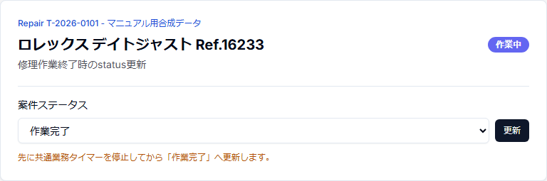
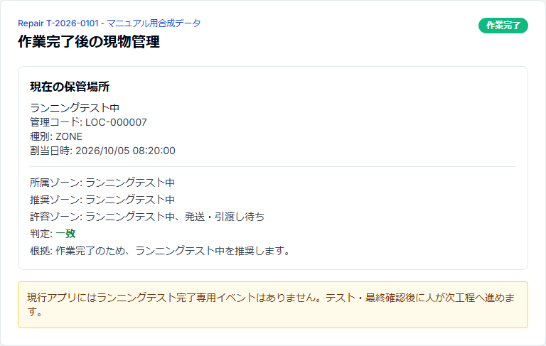

# 第20章 作業完了処理とLINE作業完了連絡

## 20.1 「修理作業が終わった」と「発送してよい」は分ける

現行アプリでは、Repair.statusの `作業完了` は修理作業工程が終わったことを表す。

ただし、時計修理の実運用ではその後にランニングテスト・最終確認を行い、問題がないことを確認してから発送準備へ進む。

現行ではランニングテスト完了専用イベントはまだ保存されないため、次の操作を分けて行う。

1. 実修理作業を終了する。
2. activeな修理タイマーを停止する。
3. Repair.statusを `作業完了` にする。
4. StorageLocationの推奨zoneを確認し、blocked等の優先条件がない通常ケースでは現物を `ランニングテスト中` へ移す。
5. 必要日数のランニングテスト・最終確認を行う。
6. 問題がなければ `発送・引渡し待ち` へ現物を移す。
7. B2Cでは「作業完了のLINE連絡」を明示操作する。

## 20.2 タイマーを先に停止する

Repair.statusを `作業完了` に変更しても、WorkTimeSessionは自動停止しない。

作業終了時は画面上部の共通業務タイマーで `停止` を押し、active sessionが残っていないことを確認する。

実作業終了後もタイマーを動かし続けると実績時間が過大になるため、status変更とは別に必ず確認する。

## 20.3 Repairを「作業完了」にする

Repair詳細のstatus操作で `作業完了` を選び、更新する。



status変更時にはRepairStatusLogが追加される。

statusを `作業完了` にしただけでは、次の処理は自動実行されない。

- LINE送信
- Shipment作成
- PhysicalTag release
- StorageLocation移動
- ランニングテスト完了記録
- 発送済み更新

## 20.4 作業完了後の推奨保管場所

`作業完了` かつ `RepairPlanningState.blocked=false` の通常ケースでは、StorageLocation recommendationは次のようになる。

- 推奨: `ランニングテスト中`
- 許容: `ランニングテスト中` / `発送・引渡し待ち`

`blocked=true` の場合は中断理由を優先する。`WAITING_PARTS` は `部品待ち`、その他のblocked理由は `要確認` が推奨されるため、画面の推奨zoneを確認してから移動する。



これはread-onlyの推奨であり、自動移動ではない。

時計を実際にランニングテスト用の場所へ移した後、ScanSession `保管場所移動` でStorageLocationAssignmentを更新する。

## 20.5 ランニングテストの現行仕様

Scheduler設定には `runningTestDays` を保存でき、納期逆算・工程buffer計算で使用する。

一方、現時点では次の専用正本イベントは実装されていない。

- ランニングテスト開始日時
- ランニングテスト完了日時
- テスト結果
- 完了ボタン

そのためShipmentの発送予定画面でも「ランニングテスト完了」は `判定不可 / 完了イベント未実装` と表示される。

マニュアル上は、blocked等の優先条件がない通常ケースでは現物を `ランニングテスト中` zoneへ置き、必要日数のテストと最終確認を実施したことを作業者が確認してから次工程へ進む。blocked中は画面の推奨zoneと中断理由を優先する。

将来専用イベントが実装された場合、この章と発送章を更新する。

## 20.6 問題が見つかった場合

ランニングテスト・最終確認中に再調整や追加作業が必要になった場合、発送準備へ進めない。

Repair.status、PlanningState、必要な顧客確認・部品待ち等を実際の状況へ戻し、必要な作業を行う。

StorageLocationも現物の実際の置き場所と一致させる。

## 20.7 作業完了LINEは自動送信しない

B2C案件では、Repairの「LINE」タブ内に `作業完了のLINE連絡` パネルがある。

Repair.statusを `作業完了` にしただけではLINEは送られない。

作業者が最終確認後に、送信内容を確認して明示的に送信待ちへ追加する。


## 20.8 作業完了LINEの対象条件

作業完了連絡はserver側でも再検証する。

主な条件:

- B2C (`Customer.type = individual`)
- Repair.status = `作業完了`
- 元のInquiryからpromotionされたRepairである
- LINE Manager上の確認済み送信先が存在する
- 同じRepairの作業完了通知intentが既に存在しない

`Customer.lineId` だけを見て送信先へfallbackしない。

条件を満たさない場合、パネルには対象外または送信先未確認の案内を表示する。

## 20.9 送信文面の確認

初期冒頭文は次の内容である。

> 修理作業が完了しました。これから発送準備を進めます。

冒頭文は送信前に編集できる。

`送信内容を確認` を押すと、Admin認証済み処理で配達希望回答URLを準備し、最終送信文面へ次の内容を自動追加する。

- 配達日時の回答依頼
- 希望がない場合も `希望なし` を選択する案内
- `/customer/delivery/{token}` の回答URL

最終文面を画面で確認してから `この内容で送信待ちに追加` を押す。

## 20.10 「送信待ち」と「送信済み」は別

ボタン操作で作られるのはLINE Manager Outboxの `APPROVED` intentであり、その時点では送信済みではない。

```text
画面で送信内容を確認
  ↓
APPROVED = 送信待ち
  ↓
local senderがclaim
  ↓ durable fence
POST_UNCONFIRMED = 実送信結果未確定
  ↓
lineoa / LINE Manager通常トークへPOSTを試行
  ↓
LINE Manager履歴を照合
  ↓
CONFIRMED = 送信済み確認
```

画面ではOutbox状態を日本語で表示する。

| status | 表示 | 意味 |
| --- | --- | --- |
| APPROVED | 送信待ち | sender処理待ち |
| CLAIMED | 送信処理中 | local senderが処理中 |
| PRE_SEND_FAILED | 送信前エラー | durable fence前の送信前処理で失敗 |
| POST_UNCONFIRMED | 送信結果の確認待ち | durable fence済み・実送信結果未確定 |
| CONFIRMED | 送信済み | LINE Manager履歴で確認済み |
| CANCELLED | 取消済み | intent取消 |

## 20.11 POST_UNCONFIRMEDでは再送しない

`POST_UNCONFIRMED` は「送れていない」という意味ではない。

`POST_UNCONFIRMED` はLINE ManagerへのPOST前にdurable fenceで設定される。そのため、実際にPOSTまで到達した場合と、fence後・POST前に失敗した場合の両方を含み得る。

この状態で同じ文章を手動再送すると二重送信になる可能性があるため、再送せず `状態を更新` して確認する。

UIも再送操作をblockする。

## 20.12 CONFIRMEDを確認する

正常に送信確認できると、パネルに次を表示する。

- 作業完了連絡: `送信済み`
- 送信待ち登録日時
- 送信確認日時


Outboxの `CONFIRMED` は、Repair.statusとは別の送信実績である。

## 20.13 配達希望回答は別データ

作業完了LINEに含まれる配達希望URLからの回答は、RepairDeliveryPreferenceとして構造化保存される。

希望日・希望時間帯・Shipmentへの反映条件等は第21章で扱う。

LINE送信確認と顧客の配達希望回答は別イベントであり、`CONFIRMED` になっただけでは配達希望回答済みにはならない。

## 20.14 推奨する実運用順

現行システムで安全に運用する通常ケースの順序は次のとおり。作業完了時にblocked等が残っている場合は、このフローへ進む前に画面の推奨zoneと中断理由を確認する。

```text
修理作業を終了
  ↓
修理タイマー停止
  ↓
Repair = 作業完了
  ↓
現物を「ランニングテスト中」へ移動
  ↓
ランニングテスト・最終確認
  ↓ 問題なし
現物を「発送・引渡し待ち」へ移動
  ↓
LINEタブで作業完了連絡の最終文面を確認
  ↓
送信待ちへ追加
  ↓
CONFIRMEDを確認
  ↓
顧客の配達希望回答 / Shipment工程へ
```

ランニングテスト完了イベントが実装されるまでは、テスト完了の判断は人が行い、Shipment画面の「判定不可」を完了済みと読み替えない。
