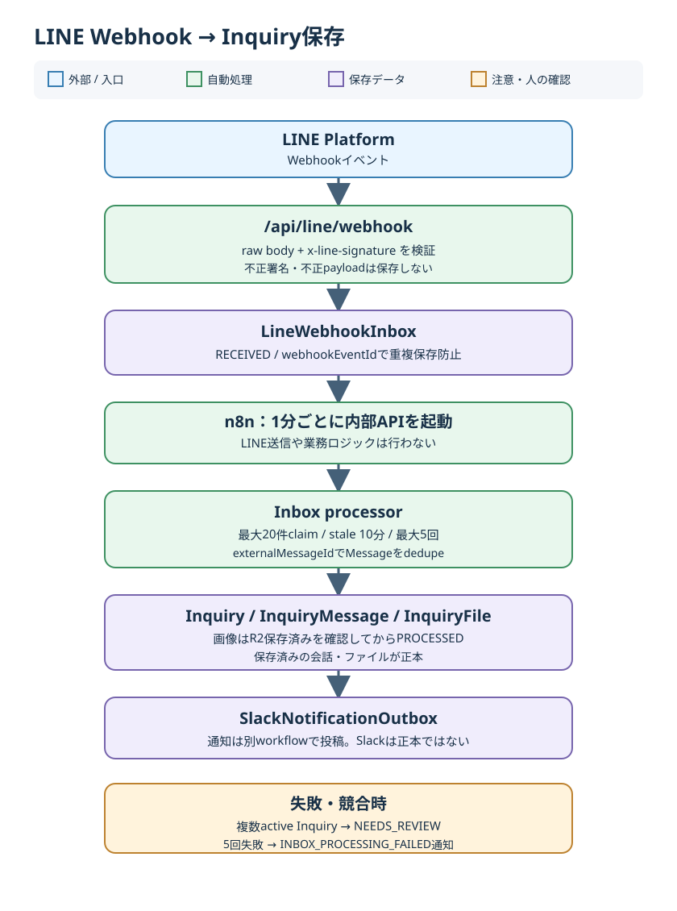

# 第27章 LINE WebhookとInquiry保存

## 27.1 この章の範囲

第5章は受付の業務フロー、第6章は会話・画像の正本を説明する。本章はWebhookから正本保存までの内部構造、再試行、重複防止、障害時の切り分けを扱う。n8nの運用は[第29章](29_n8n.md)、Slack通知の運用は[第30章](30_slack.md)を参照する。

## 27.2 受信口と最初の永続化

`POST /api/line/webhook` はJSONへ変換する前のraw bodyを読み、`x-line-signature` をchannel secretでHMAC-SHA256検証する。secret未設定は503、署名不正は401、不正なJSONや`events`形式は400で、いずれもInboxへ保存しない。署名検証後、`message`・`follow`・`unfollow`・`postback` のうち、有効な`webhookEventId`を持つイベントを`LineWebhookInbox`へ`RECEIVED`として保存する。重複したWebhook event IDは`skipDuplicates`で追加しない。

Webhookの成功応答は**Inboxへの受信保存**を意味する。Inquiry作成、画像のR2保存、Slack投稿まで完了したという意味ではない。受信口は業務処理をその場で完結させず、後続処理に渡す。

## 27.3 n8nとprocessorの責任境界

ローカルn8nの`LINE Inquiry Inbox Processor`は1分間隔で`POST /api/internal/line-inbox/process`を起動する。n8nは起動役であり、署名検証、Inquiryへの割当、画像保存、再試行判定はNext.js側のprocessorが行う。n8nはLINE返信を送らない。

processorは通常1回で最大20件をID順に候補取得し、条件付き更新で`PROCESSING`へclaimする。対象は`RECEIVED`、`FAILED`、または最終試行から10分超の`PROCESSING`で、`attemptCount < 5`の項目に限る。claim時に試行回数を増やすため、競合して同じ候補を見ても、条件付き更新に成功した処理だけが担当する。

| Inbox status | 読み方 |
| --- | --- |
| `RECEIVED` | 署名検証済みで保存済み。後続処理待ち |
| `PROCESSING` | processorがclaim済み。10分超のstale項目は再claim対象 |
| `FAILED` | 処理失敗。5回未満なら後続起動で再試行 |
| `PROCESSED` | 対象イベントの後続処理が完了 |

## 27.4 LineUser、Inquiry、Messageの確定

`message`または`follow`にLINE user IDがあれば`LineUser`を作成・更新する。既存`Customer.lineId`との**完全一致が1件だけ**のときに限って自動リンクする。表示名、顧客名、本文の類似を本人確認に使わない。重複したCustomerがあれば自動リンクせず調査対象にする。

`follow`はLineUser更新の対象だが、それだけで`InquiryMessage`を作らない。`unfollow`と`postback`もInboxには保存するが、現行processorはそれらから問い合わせ本文を作らない。

有効なテキスト・画像メッセージでは、LINEのmessage IDを`InquiryMessage.externalMessageId`として保存する。保存処理はLineUser単位のtransaction lock下で先に同じ`externalMessageId`を探し、既存なら再利用する。並行処理の一意制約競合でも既存メッセージを再取得する。これはWebhook event IDの重複防止とは別の、**業務メッセージ単位のdedupe**である。

同じLineUserのactive Inquiryが0件なら新規作成、1件ならそこへ追加する。複数件が競合する場合は誤った1件へ寄せず、`NEEDS_REVIEW`のInquiryを使用または作成して人の確認へ回す。`CLOSED`後の新しい受信は別Inquiryになり得る。`InquiryMessage`は`INBOUND`として保存し、原文をAI分析で上書きしない。

## 27.5 画像と通知の完了条件

画像では`INBOUND`の`InquiryMessage`を作った後、画像handlerがLINEから本体を取得・変換しR2へ保存する。processorは対応する`InquiryFile.uploadStatus`が`STORED`になったことを確認してから通知を確保し、Inboxを`PROCESSED`にする。画像の保存が終わらなければ失敗扱いで再試行する。サイズ・変換条件と管理画面での表示は[第5章](05_line-inquiry-intake.md)・[第6章](06_inquiry-line-storage.md)を参照する。

通知は`SlackNotificationOutbox`へ別途保存する。通常通知はmessage IDに基づくdedupe keyでupsertされるため、Inboxの再試行だけで同じ通知を増やさない。Slackは注意喚起の経路であり、問い合わせの正本は保存済み`Inquiry`・`InquiryMessage`・`InquiryFile`である。Slackへの投稿と結果返却は別のn8n workflowが担う。

## 27.6 再試行と最終失敗

処理例外ではInboxを`FAILED`にし、`lastError`を記録する。次の定期起動で5回未満なら再試行する。画像処理のようにMessage作成後に失敗しても、`externalMessageId`によるdedupeと保存状態の確認を使って再開する。5回目も失敗した場合は`SlackNotificationOutbox`へ`INBOX_PROCESSING_FAILED`を一度だけ作り、受信済みイベントは削除しない。自動claimの上限に達したInboxは、人が原因を調べる対象となる。

## 27.7 障害時の切り分け

1. Webhook応答が401/400/503なら、署名・payload・server設定を区別する。raw bodyやsecretをログへ出さない。
2. `LineWebhookInbox`に`RECEIVED`が残るなら、n8nのtask、workflow、直近execution、内部APIの認証と応答を確認する。
3. `PROCESSING`が残るなら最終試行時刻を確認する。10分未満の処理中をすぐ再実行扱いにしない。
4. `FAILED`なら`attemptCount`と`lastError`を確認する。画像なら`InquiryFile`の保存状態とR2処理を確認する。
5. `PROCESSED`なのに通知が見えないなら`InquiryMessage`・`InquiryFile`を先に確認し、次に`SlackNotificationOutbox`とSlack側workflowを確認する。Slack未着だけでLINE未受信とは判断しない。
6. `NEEDS_REVIEW`なら複数active Inquiryなどの競合を確認し、顧客名だけで手動統合しない。

`INBOX_PROCESSING_FAILED`の通知内容にLINE本文は含まれない。調査時もtoken、署名、顧客本文、画像URLをログやマニュアルへ転記しない。
