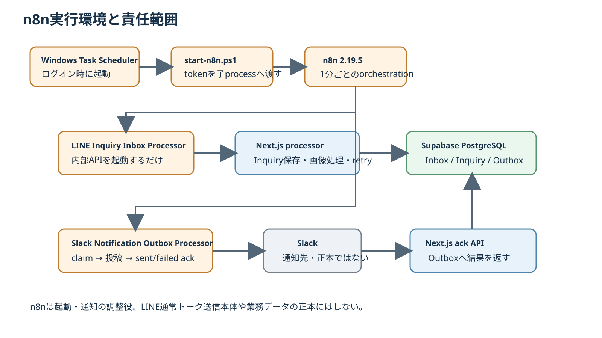

# 第29章 n8n連携

## 29.1 n8nの役割

n8nは、時計修理業務アプリの正本データを保存する場所ではなく、定期処理や外部通知を実行するローカル自動化基盤として使う。

現在の主要用途は次の2つである。

1. LINE Webhook Inboxの後処理を1分ごとに起動する。
2. Slack通知Outboxを1分ごとに取り出してSlackへ投稿する。

AI分析やLINE通常トークの送信本体はn8nの役割ではない。

## 29.2 現在の実行環境

2026-10-04確認時点の実環境は次のとおり。

- n8n version: 2.19.5
- 実行方式: WindowsローカルのNode.js / n8n CLI
- Docker: 使用していない
- n8n user folder: `C:\Users\yoshi`
- DB: `C:\Users\yoshi\.n8n\database.sqlite`
- service launcher: `C:\Users\yoshi\n8n-service\start-n8n.ps1`
- stdout / stderr: `C:\Users\yoshi\n8n-service\logs\`

## 29.3 自動起動

Windowsタスクスケジューラに `YoshidaClockRepair-n8n` が登録されている。

Triggerはログオン時で、hidden PowerShellから `start-n8n.ps1` を起動する。

```text
Windowsログオン
    ↓
Scheduled Task: YoshidaClockRepair-n8n
    ↓
powershell.exe -File C:\Users\yoshi\n8n-service\start-n8n.ps1
    ↓
n8n start
    ↓
active workflowsが定期実行
```

## 29.4 start-n8n.ps1

launcherはUser環境変数から `N8N_INTERNAL_TOKEN` を取得し、n8n processの環境変数へ渡す。

必要なtokenが未設定の場合は起動を停止する。

token値をscriptへハードコードせず、マニュアルにも記載しない。

また、n8nの標準出力・標準エラーは `n8n-service\logs` 配下へ保存する。

## 29.5 Active workflow一覧

2026-10-04確認時点でactive workflowは2本である。

| Workflow | ID | 間隔 | 役割 |
| --- | --- | --- | --- |
| LINE Inquiry Inbox Processor | `LineInboxProc001` | 1分 | LINE Webhook Inboxの後処理 |
| Slack Notification Outbox Processor | `SlackOutboxProc001` | 1分 | Slack通知Outboxの投稿・結果返却 |

調査時点では両workflowとも1分ごとにsuccessで実行されていることをexecution historyで確認した。

## 29.6 LINE Inquiry Inbox Processor

ノード構成は2ノードだけである。

```text
Every Minute
    ↓
Process Inbox
```

`Every Minute` はcron `* * * * *`。

`Process Inbox` は次の内部APIをPOSTする。

```text
https://yoshidawatchrepair.com/api/internal/line-inbox/process
```

Authorization headerにはBearer tokenを付与する。

### n8nが行わないこと

このworkflow自身が以下を直接実装しているわけではない。

- LINE署名検証
- Inquiry作成ロジック
- 画像変換
- R2保存
- retry判定
- Slack本文作成

n8nは内部APIを起動するだけで、業務ロジックはNext.jsアプリ側へ置く。

この分離によりworkflowが複雑化せず、正しさ・transaction・retryルールをアプリコード側で管理できる。

## 29.7 Slack Notification Outbox Processor

ノード構成は次の4段階である。

```text
Every Minute
    ↓
Claim Notifications
    ↓
Split Notifications
    ↓
Post to Slack
    ↓
Acknowledge Result
```

### Claim Notifications

1分ごとに次の内部APIへPOSTする。

```text
https://yoshidawatchrepair.com/api/internal/slack-notifications/claim
```

アプリ側の `SlackNotificationOutbox` から送信対象をclaimする。

### Split Notifications

複数件返却された通知を1件ずつSlack nodeへ渡す。

### Post to Slack

n8nのSlack nodeで指定channelへmessageを投稿する。

通知本文はアプリ側が作成済みのtextを使用し、n8n側で問い合わせ内容を推測・再構成しない。

### Acknowledge Result

Slack投稿結果に応じて、次のどちらかをアプリへPOSTする。

```text
/api/internal/slack-notifications/{id}/sent
/api/internal/slack-notifications/{id}/failed
```

これにより、Slackへ投稿したかどうかの結果をn8nだけに閉じ込めず、アプリ側Outboxへ戻す。

## 29.8 n8nとAIの境界

現在のAI Inquiry解析はn8n workflowではない。

```text
n8n
├─ LINE Inbox後処理を起動
└─ Slack通知を投稿

カタリ / inquiry-ai-bridge.ps1
└─ AI暫定分析
```

将来AI自動化を追加する場合でも、現在の正本・人確認・stale防止ルールを壊さないことが前提となる。

## 29.9 n8nとLINE送信の境界

顧客へのLINE通常トーク送信もn8nから直接行わない。

LINE返信は `LineManagerSendOutbox` へ入り、専用のローカルLINE Manager senderとlineoaを使って送信し、Manager履歴照合後にCONFIRMEDとする。

n8nとLINE senderを混同しない。

## 29.10 障害時の基本確認

n8n連携が止まっている疑いがある場合は、次の順で確認する。

1. Windowsタスク `YoshidaClockRepair-n8n` がRunningか。
2. n8nのNode processが起動しているか。
3. `n8n-service\logs` のstdout / stderrに起動エラーがないか。
4. active workflowが無効化されていないか。
5. execution historyで直近実行がsuccessか。
6. LINE Inbox Processorだけ失敗しているか、Slack Processorも失敗しているか。
7. 401なら内部token不一致を疑う。
8. 503ならアプリ側の内部token設定不足を疑う。
9. アプリ側Outbox / InboxのstatusとlastErrorを確認する。

secretをログへ出すためのdebug変更は行わない。

## 29.11 バックアップ

n8nのworkflowとSQLite DBはアプリrepositoryとは別管理である。

repositoryのGit backupだけではn8n workflow設定を復元できないため、n8n設定は別途バックアップ対象として扱う。

現在ホームディレクトリにn8n workflow export / backup関連ファイルと `n8n-backups` ディレクトリが存在するが、正式な復旧手順はバックアップ章で実ファイル・更新運用を再確認して確定する。

## 29.12 n8n構成図



図のとおり、n8nは定期起動とSlack通知の調整役であり、Inquiry保存・画像処理・retry等の業務ロジックはNext.js側、正本データはSupabase側に置く。
