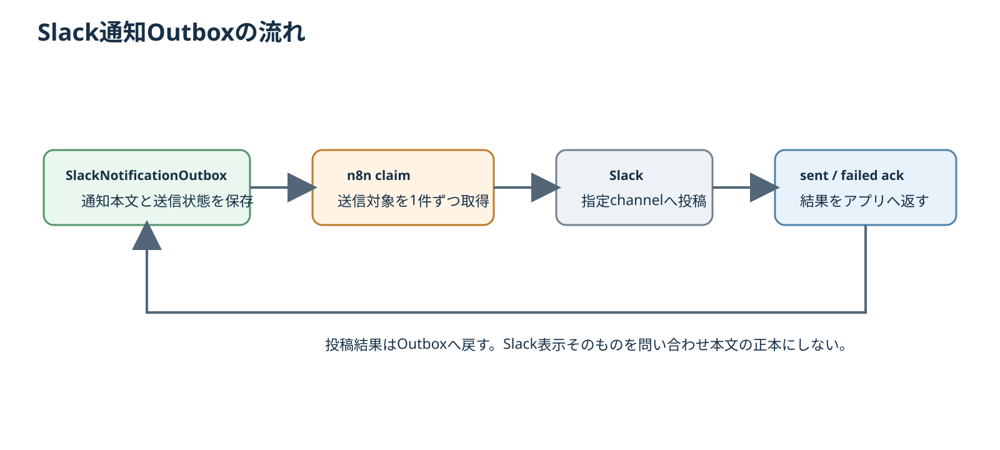

# 第30章 Slack通知

## 30.1 Slackの役割

Slackは、新しい問い合わせや処理失敗に気付くための通知チャネルである。

**問い合わせ本文や案件状態の正本ではない。** 正式な確認・返信・受付判断は管理画面のInquiry / Repairで行う。

```text
LINE受信・アプリ処理
    ↓
SlackNotificationOutbox
    ↓
n8nが1分ごとにclaim
    ↓
Slackへ通知
    ↓
送信結果をアプリへsent / failedで返却
```

## 30.2 通知Outboxを使う理由

アプリ処理の途中から直接Slack APIへ投稿せず、まず `SlackNotificationOutbox` を作成する。

これにより、問い合わせデータの保存成功とSlack投稿成功を分離できる。Slackが一時的に失敗しても、LINE原文やInquiryを失わない。

また、dedupe keyを使って同じLINEメッセージから同じ通知を重複作成しない。

## 30.3 現在の主要通知種別

LINE問い合わせ処理では、状況に応じて主に次の通知種別を作成する。

| 種別 | 意味 |
| --- | --- |
| `NEW_INQUIRY` | 新しいInquiryの最初の受信 |
| `IMAGE_ADDED` | 既存Inquiryへ画像が追加された |
| `INQUIRY_UPDATED` | 既存Inquiryへメッセージが追加された |
| `NEEDS_REVIEW` | 自動で1件のInquiryへ安全に決められず人確認が必要 |
| `INBOX_PROCESSING_FAILED` | LINE Inbox処理が最大再試行回数に到達した |

## 30.4 通知に載せる情報

通常の問い合わせ通知では、次のような業務上必要な概要だけを送る。

- Inquiry番号
- 既存顧客か未登録LINEユーザーか
- LINE表示名または顧客名
- INBOUNDメッセージ件数
- 保存済み画像件数
- Inquiry status
- AI処理がまだpendingであること

**顧客がLINEで送った本文そのものはSlack通知へ含めない。**

詳細を確認するときは、Slackを読んで判断するのではなく、管理画面のInquiryを開く。

## 30.5 n8nのSlack workflow

`Slack Notification Outbox Processor` が1分ごとに実行される。

```text
Every Minute
    ↓
Claim Notifications
    ↓
Split Notifications
    ↓
Post to Slack
    ↓
Acknowledge Result
```

### Claim Notifications

Next.jsの内部APIから送信対象のOutboxをclaimする。

```text
POST /api/internal/slack-notifications/claim
```

内部APIは `N8N_INTERNAL_TOKEN` のBearer認証を要求する。

### Split Notifications

claim結果が複数件ある場合、1件ずつSlack nodeへ渡す。

### Post to Slack

アプリ側で作成済みの通知本文をSlackへ投稿する。

n8n側で顧客LINE本文を取得したり、AIで要約を作り直したりしない。

### Acknowledge Result

投稿後、成功・失敗を次の内部APIへ返す。

```text
POST /api/internal/slack-notifications/{id}/sent
POST /api/internal/slack-notifications/{id}/failed
```

これにより「Slackへ投稿しようとした結果」をアプリ側で追跡できる。

## 30.6 日常操作

新規問い合わせ通知が来た場合の基本操作は次のとおり。

1. SlackでInquiry番号を確認する。
2. 管理画面のInquiry一覧を開く。
3. 対象Inquiryのレビュー画面を開く。
4. 保存済みLINE本文・画像を確認する。
5. 必要ならカタリへAI解析を指示する。
6. AI候補を人がレビューして受付判断へ進む。

Slack上で「受付可」「見積確定」「送信済み」などの正式判断を完結させない。

## 30.7 `NEEDS_REVIEW` 通知

同一LineUserに複数のactive Inquiryがあるなど、アプリが安全に1件へ割り当てられない場合は、誤統合せず `NEEDS_REVIEW` として人へ回す。

この通知が出た場合は、顧客名だけで機械的に統合せず、LINE履歴とInquiryの状態を管理画面で確認する。

## 30.8 `INBOX_PROCESSING_FAILED` 通知

LINE Inbox処理は再試行できるが、同じ項目が最大試行回数へ到達した場合はエラー通知を作る。

通知が来ても、受信済みのWebhookデータを削除して再受信を期待しない。保存済み `LineWebhookInbox` のstatus / lastErrorとn8n executionを確認して原因を切り分ける。

## 30.9 Slack通知が来ない場合

次の順で確認する。

1. LINE Webhookが `LineWebhookInbox` へ保存されているか。
2. `LINE Inquiry Inbox Processor` が直近1分でsuccessか。
3. `SlackNotificationOutbox` が作成されているか。
4. `Slack Notification Outbox Processor` がactiveか。
5. n8n executionがsuccessか。
6. Outboxがsentかfailedか。
7. Slack nodeのcredential / channel設定に問題がないか。

「Slack通知が来ない」ことと「LINE問い合わせ自体を受信していない」ことを同じ障害として扱わない。

## 30.10 Slack通知Outboxの流れ



通知本文と送信状態はSlack画面そのものを正本にせず、アプリ側の`SlackNotificationOutbox`と保存済みInquiryを基準に確認する。
