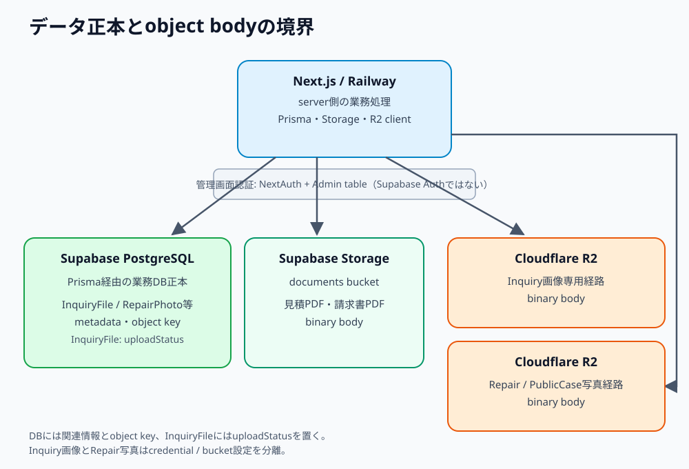

# 第32章 Cloudflare R2

## 32.1 R2が保持するもの

Cloudflare R2はInquiry画像とRepairPhotoのobject bodyを保存する。Supabase PostgreSQLは両者の業務上の関連、metadata、object keyを保持する。`InquiryFile`だけが`uploadStatus`（`PENDING` / `STORED` / `FAILED`）を持ち、`RepairPhoto`に相当するfieldはない。DB上のkeyだけでobjectの保存成功を意味するとは限らないため、Inquiry画像は`InquiryFile.uploadStatus`を、RepairPhotoはR2 object、DBの`RepairPhoto` row、rollback結果を確認する。



R2のInquiry画像経路とRepairPhoto経路はcredentialとbucketの設定が分離されている。共通のR2 endpointを使用する実装でも、同一の権限や同一bucketを前提にしない。keyやcredentialの実値はマニュアル、画面、ログへ載せない。

## 32.2 LINE Inquiry画像の取り込み

LINEから届いた画像は、Next.js serverがLINE content APIから取得する。取得対象は画像contentで、bodyの上限は20 MiB。画像を向き補正（rotate）した後、3000×3000の枠に長辺が収まるよう縮小する。元画像の拡大はしない。出力はWebP、quality 85である。

保存keyの形式は`inquiries/YYYYMM/uuid.webp`。R2へは`image/webp`、`private, max-age=0`で保存する。DBの`InquiryFile`はLINE側のsource messageと結び付き、bucket、object key、mime type、サイズ、縦横、`uploadStatus`などを保持する。

```text
LINE content API → 20 MiB上限確認 → rotate / 縮小 / WebP変換
                 → R2 object保存 → InquiryFileをSTOREDへ更新
```

新規レコードは`PENDING`で作成する。取得・変換・R2保存・DB更新が成功したとき`STORED`になり、失敗時は`FAILED`とエラー情報を保存する。`FAILED`からの再試行では`PENDING`に戻す。正規の画像表示対象は`STORED`だけである。

管理画面はNextAuth認証済みのsame-origin route `GET /api/inquiries/[id]/line/files/[fileId]`から画像を開く。routeはInquiryとfileの対応、`STORED`、key形式を確認し、5分（300秒）有効のR2 signed read URLへredirectする。signed URLは一時的な閲覧用であり、保存・転記・ログ出力しない。

## 32.3 RepairPhotoと公開事例写真

RepairPhotoのupload対象はJPEG、PNG、WebP。object keyは`repairs/{repairId}/YYYYMM/{uuid}.{ext}`で、修理案件に紐付くmetadataはDBの`RepairPhoto`に保存する。public caseへのコピーは別のobjectとして`public-cases/{publicCaseId}/...`に置く。RepairPhotoのsigned read URLは既定で300秒有効である。

`POST /api/upload`ではR2 objectを先に作成してからDB metadataを作成する。DB保存に失敗したときは、作成済みR2 objectのdelete rollbackを試みる。削除自体も失敗し得るので、DB保存失敗とR2上の残存可能性を分けて調査する。

管理者向け`GET /api/repair-photos/[photoId]`はNextAuth sessionとDBレコード・key形式を確認してsigned URLへredirectする。古い非R2写真はこのrouteではR2 objectとして返さない。

## 32.4 Supabase Storageとの棲み分け

見積PDFと請求書PDFはR2ではなくSupabase Storageの`documents` bucketに保存する。DBはそれぞれの文書レコードと保存先情報を保持する。画像障害とPDF障害では確認先が異なる。

| ファイル | bodyの保存先 | DBで追う情報 |
| --- | --- | --- |
| LINE Inquiry画像 | R2 Inquiry画像経路 | `InquiryFile`のmetadata / key / `uploadStatus` |
| RepairPhoto / PublicCase写真 | R2写真経路 | RepairPhoto等の関連metadata / key |
| 見積PDF・請求書PDF | Supabase Storage `documents` | 文書レコードとstorage key |

## 32.5 障害時の確認

Inquiry画像が見えない場合は、source message、`InquiryFile.uploadStatus`、R2保存結果、認証済みrouteの応答を順に確認する。`PENDING`や`FAILED`を保存済みとして表示しない。RepairPhotoならuploadでR2作成まで成功したか、DB metadata作成とrollbackの結果、read routeでの認証・key判定を確認する。PDFは第31章のSupabase Storage経路を確認する。調査記録にはstatusや失敗段階を残し、raw object key、signed URL、credentialを載せない。
