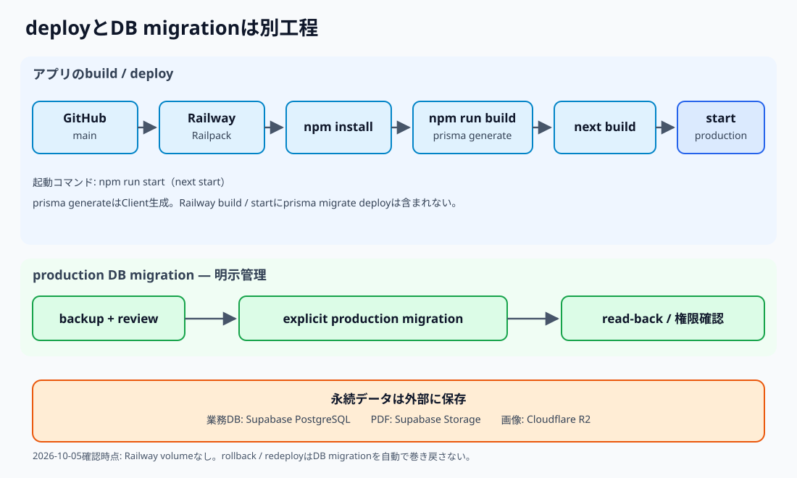

# 第33章 Railway

## 33.1 Railwayの役割

RailwayはNext.jsアプリをbuildし、productionで実行・deployする場所である。業務データの正本はSupabase PostgreSQL、ファイルbodyの保存先はSupabase StorageやCloudflare R2であり、Railway filesystemやインスタンスを永続データの正本にしない。

2026-10-05確認時点のproduction serviceは`clock-repair-system`、environmentは`production`。GitHub `yoshida-tokei919/clock-repair-system`の`main`に接続し、custom domainは`yoshidawatchrepair.com`、target portは8080。regionは`sin`、replicaは1、mounted volumeとRailway bucketはない。

## 33.2 現行build / start

builderはRailpack、build environmentはV3、runtimeはV2。2026-10-05に確認したbuild logではRailpack 0.40.1、Node 22.23.2で、`npm install` → `npm run build` → `npm run start`の順に進む。`package.json`のbuild scriptは`prisma generate && next build`、start scriptは`next start`である。

`prisma generate`はPrisma Clientの生成であり、DB migrationではない。確認時のNext.jsは15.5.27、Prisma Clientは5.7.0で、buildのcompile / type checkとstatic pages 56/56がPASSした。

2026-10-05確認時点の最新production deploymentは`SUCCESS`、source commitは`3ac7067dad80d4463f9e897167cad46d270fb4ab`（`feat: add line manager sender daemon`）。これは当日の確認記録であり、現在のdeployment状態を永続的に保証するものではない。

## 33.3 deployとDB migration

現行Railway build / start chainに`prisma migrate deploy`は含まれない。GitHub `main`へのpushでアプリがdeployされても、production DB migrationは別工程として明示管理する。schema差分を伴う変更では、migration SQL、backup、独立review、明示適用、適用後read-backを確認し、アプリとの互換性を踏まえてdeployとsmokeを行う。詳しくは[第31章 Supabase / Prisma](31_supabase-prisma.md)を参照する。

Railway上で環境変数を管理する。設定値、secret、接続文字列はマニュアルにもログにも載せない。障害調査では必要な設定の有無や接続結果を確認し、値そのものを出力しない。

## 33.4 障害の切り分け順

1. production deploymentのstatusと対象commitを確認する。
2. build logでinstall、Prisma Client生成、Next.js compile / type checkのどこで止まったかを見る。
3. runtime / deploy logで起動後の例外や応答を確認する。secretや顧客情報をログへ追加しない。
4. app smokeで必要な公開routeと認証境界の応答を確認する。
5. DBならSupabase PostgreSQL、PDFならSupabase Storage、画像なら用途別R2など、依存先ごとに切り分ける。

DB schema mismatchが疑われるときは、build成功とは別にproduction migrationの適用状況を確認する。rollbackやredeployはアプリ運用上の手段だが、適用済みDB migrationを自動で巻き戻すものではない。

## 33.5 永続性の境界

Railwayのインスタンスやfilesystemに残った一時ファイルを復旧可能な正本として扱わない。復旧・バックアップの対象は業務DBとobject storage、それぞれの保存先・運用手順に従う。volumeがないという現在の構成も、2026-10-05時点の確認内容として扱う。
