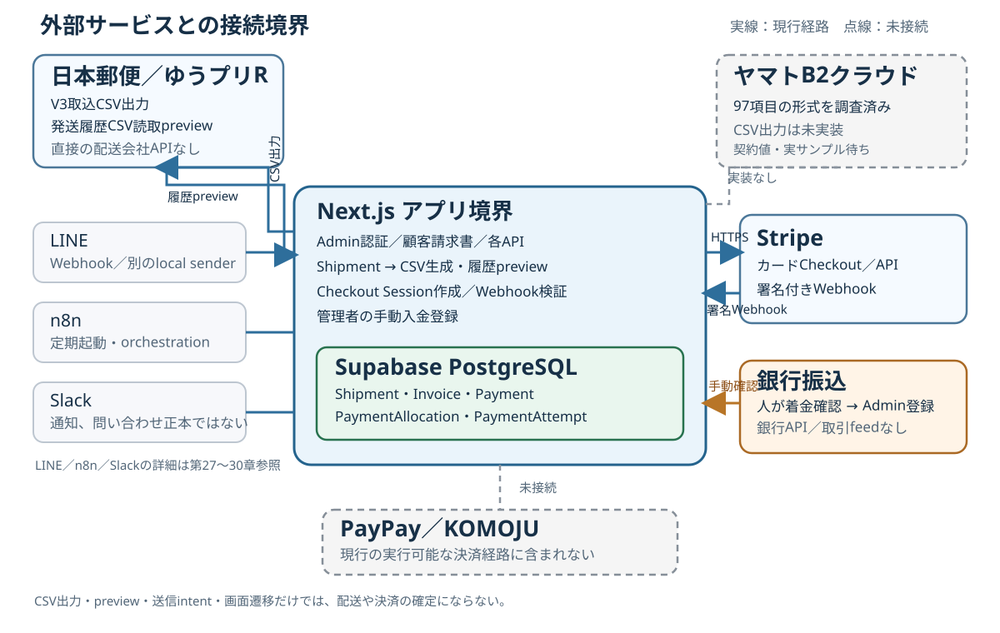

# 第34章 外部配送・決済等の接続

## 34.1 接続先と正本の一覧

この章は、外部サービスとの**現在の接続境界**を示す。CSVの出力、外部画面での操作、戻り値のプレビュー、DBへの確定は別の段階である。「連携あり」を自動更新や外部API接続の意味で読まない。図中の実線は現行経路、点線は調査・未実装の境界を表す。

| サービス | 接続方式 | アプリ側の正本 | 状態変更・確認の責任者 | 現在の状態 |
| --- | --- | --- | --- | --- |
| 日本郵便／ゆうプリR | Shipmentから取込用CSVを出力、発送履歴CSVを読取プレビュー。配送会社APIとの直接接続なし | Shipmentの宛先snapshot。履歴側はCSVのraw値と照合候補 | 送り状と現物の引渡しは担当者が外部で確認。プレビューはDBを更新しない | **実装済み：CSV出力・読取プレビューのみ**。引受・追跡・配達の書戻しは未実装 |
| ヤマトB2クラウド | CSV adapterを調査中。現行アプリにB2出力UI・API・CSV生成はない | 配送会社非依存のShipment。B2固有の確定値は未設定 | 契約固有値と受理済み実ファイルの確認が先決 | **調査完了／実装保留** |
| Stripe | 顧客のカードCheckout用にHTTPSでSessionを作成し、署名付きWebhookを受信 | Invoice、Payment、PaymentAllocation、PaymentAttempt | Stripeの決済結果をWebhookで検証し、アプリが決済レコードを確定 | **実装済み：B2C請求書のカードCheckout** |
| 銀行振込 | 振込そのものはアプリ外。管理者の手動入金登録API | Invoiceと`MANUAL`／`BANK_TRANSFER`のPayment | 入金を確認した管理者が明示登録。銀行APIや取引明細feedは使わない | **実装済み：手動確認・登録** |
| PayPay／KOMOJU | 現行の実行可能な決済経路には接続しない | PayPayはenum・表示ラベルのみ。KOMOJUは本Taskで確認したrepo証拠に実装参照なし | 決済確定者・連携経路は未定義 | **未実装**。将来の採用可否をここで決めない |
| LINE Webhook／LINE Manager sender | Webhook受信と、別のWindows local senderによる送信・履歴照合 | InquiryMessage等の保存済み記録、送信Outbox | Webhook processorと履歴照合。送信intentだけでは送信済みとしない | **個別に実装**。詳細は第27・28章 |
| n8n／Slack | n8nが処理を定期起動し、Slackへ通知 | 問い合わせはSupabaseのInquiry等。Slack投稿は正本でない | n8nはorchestration、Slackはnotification | **個別に実装**。詳細は第29・30章 |

## 34.2 日本郵便／ゆうプリRのファイル境界

現行アプリは配送会社APIへ送り状作成や追跡照会を直接要求しない。Admin認証が必要な`GET /api/shipments/[id]/yupuri-v3`が、OUTBOUND・発送前のShipmentの宛先snapshotから、ゆうプリR標準フォーマットV3を**読取専用で生成**する。共通`/shipments`画面にこのCSVの出力ボタンはない。出力APIの運用と、ゆうプリR側への取込・発行・印刷は分けて扱う。

| V3出力契約 | 内容 |
| --- | --- |
| CSV | 固定100列、headerなし、CP932／Shift_JIS、BOMなし、CRLF |
| お客様側管理番号 | `SHP-{Shipment.id}`。後の履歴候補照合に使う |
| 宛先 | Shipment作成時のdestination snapshot。Customerの現住所へfallbackしない |
| 出力時の変化 | Shipment、Repair、追跡番号、status、`labelIssuedAt`を更新しない |

荷物サイズコードは現時点で`060`固定である。実荷物が60サイズ以外なら、この値をそのまま使えると判断しない。未対応の配達希望値やCP932で表現できない文字は推測変換せずエラーにする。

Admin認証が必要な`POST /api/shipments/yupuri-history/preview`は、ゆうプリR発送履歴CSVを解析して照合候補とエラーを返す。対象はCP932・BOMなし・CRLF・headerあり6列のファイルで、`SHP-{Shipment.id}`により候補を照合する。追跡番号・日付・status codeは候補またはraw値にとどめ、**追跡番号、Shipment／Repair status、実発送日時、配達完了日時を保存しない**。重複や追跡番号競合、形式不正も自動解決しない。

現時点で意味が確認されたstatusの組は`10/0A = 引受予定`のみであり、**実際の郵便局引受を証明しない**。実引受・配達完了のコードと日付形式は実際のゆうプリR履歴証拠を待つ。Task202B／Task204の追跡保存、配送状態更新、LINE発送通知を、CSV出力やpreviewの結果から先取りしない。業務上の詳細は[第25章](25_yupuri.md)を参照する。

## 34.3 ヤマトB2クラウドの調査境界

Task201Bは**調査完了／実装保留**である。公式資料で取込レイアウトが**固定順97項目**であり、列の削除や並べ替えを前提にしないことを確認した。一方、必須の請求先顧客コード・運賃管理番号などは契約・設定に依存する。依頼主情報、利用サービス、header・開始行・encodingを含む受理済みの基本テンプレートまたは実サンプルも、実装前に確定が必要である。

現行repoにはヤマトB2用CSV出力のUI、API、adapter実装がない。Shipmentの共通宛先データがあることは、B2用ファイルを今すぐ出せることを意味しない。契約固有値や実ファイルの証拠が揃うまで列値・コード・文字コードを推測しない。B2固有項目は将来のadapter境界に置く方針であり、現行Shipmentの正本へ混ぜない。契約コードや実アカウント値はマニュアルへ転記しない。

## 34.4 Stripe CheckoutからWebhook確定まで

現行の顧客Checkout APIは`POST /api/customer/invoices/[token]/checkout`。請求書の公開tokenから対象を取得し、`customer.type === individual`、`invoice.status === issued`、税込総額が正、未入金残高が正であることを確認する。共通の支払作成helperは、処理中のPaymentや部分入金済み請求書を拒否する。したがって画面上に未入金残高が見えても、部分入金後の追加Checkoutはこの経路では扱わない。顧客が金額やproviderを指定してPaymentを作る契約ではない。

新規開始時はInvoiceとの単一`PaymentAllocation`を伴う`Payment(provider=STRIPE, method=CARD, status=PENDING)`を作り、`PaymentAttempt`にidempotency keyを保持する。そのkeyでStripe Checkout Sessionを作る。Sessionは`mode=payment`、通貨`jpy`、`payment_method_types: ["card"]`、請求総額の1明細である。Session IDをAttemptに記録して顧客をCheckout URLへ移す。顧客請求画面にはApple Pay／Google Payの案内があるが、この章で保証する統合契約は**Stripeのcard Checkout**までであり、walletの利用可能性は約束しない。

同じ請求の`PENDING`なStripe Paymentがあるときは、保存済みSessionをStripeへ照会する。`open`なら既存URLを再利用し、`complete`だがWebhook未確定なら409で結果確認中とする。closed／expiredなら古いPaymentとAttemptを`CANCELED`にしてから作り直す。Session作成失敗は`FAILED`として扱う。URLへ戻ったことや`checkout=success`表示だけで入金済みにしない。

Stripeからの`POST /api/stripe/webhook`はraw bodyと`stripe-signature`を`STRIPE_WEBHOOK_SECRET`で検証する。署名不正や設定欠落を受け入れない。確定対象は`checkout.session.completed`で、かつ`payment_status === paid`のイベントだけである。それ以外は支払確定を行わない。

確定処理は登録済みCheckout Session IDからAttemptを探し、transaction内でPayment行をlockして再取得する。providerと状態、Session ID、金額、通貨、**単一のallocation**、PaymentとInvoiceの顧客・金額の一致、metadataのinvoice ID・請求番号・Payment ID・Attempt ID、既に記録されたPaymentIntent IDを照合する。一致した`PENDING`のAttemptとPaymentを`SUCCEEDED`へ更新し`paidAt`を保存する。両方が既に`SUCCEEDED`ならidempotentに終了する。不整合時は支払済みを推測して保存しない。請求画面の入金済額・未入金残高は`SUCCEEDED`なPaymentのallocationから計算する。

## 34.5 銀行振込は管理者の手動確認

銀行振込の着金は、この経路では銀行APIや銀行取引feedから取り込まない。管理者が別途入金を確認した後、Admin認証が必要な`POST /api/invoices/[id]/payments/manual`でB2C（`individual`）請求書に明示登録する。登録は`Payment(provider=MANUAL, method=BANK_TRANSFER, status=SUCCEEDED, paidAt=登録時刻)`と単一allocationを作る。共通helperは発行済み請求書、正の総額・未入金残高、処理中Paymentなし、部分入金なしを確認する。

顧客請求画面に振込案内が表示されること、顧客が振込操作を行ったこと、管理者が入金済みと登録したことは別の事実である。外部の着金確認なしに手動APIを自動実行する運用はこの実装に含まれない。実際の銀行口座情報は本章・図・プレビューへ載せない。

## 34.6 PayPay／KOMOJUの現行境界

Prismaの`PaymentProvider`は`STRIPE`と`MANUAL`、`PaymentMethod`は`CARD`、`PAYPAY`、`BANK_TRANSFER`を定義する。支払表示にはPayPayラベルがあり、内部helperは`STRIPE`／`PAYPAY`の`PENDING`作成を型上受け入れ得る。しかし**現行の顧客Checkout routeは`STRIPE`／`CARD`と`["card"]`しか作らない**。enumや表示ラベルを、実際に選択・決済できる証拠としない。

KOMOJUについては本Taskで照合した現行repoの証拠に実装・参照がない。したがってPayPay／KOMOJUはいずれも**現行の実行可能な決済経路に含まれない**。これは将来の事業判断を否定する意味ではない。実装・設定・検証が実在する段階で、その契約を改めて記録する。

## 34.7 LINE／n8n／Slackへの参照

この3系統は決済・配送の確定者としてまとめない。LINE Webhookの受信・Inquiry保存は[第27章](27_line-webhook.md)、LINE Manager outboxと**別のWindows local sender**による送信・履歴照合は[第28章](28_line-manager-sender.md)を参照する。n8nは内部処理の定期起動・通知のorchestrationであり、LINE Manager送信本体ではない（[第29章](29_n8n.md)）。Slackは通知先であり問い合わせ正本ではない（[第30章](30_slack.md)）。ゆうプリRの履歴previewをLINE発送通知へ自動接続したものとして扱わない。

## 34.8 障害の切り分けと秘密情報

| 症状 | 最初に確認する境界 | この章で推測しないこと |
| --- | --- | --- |
| ゆうプリR CSVを出せない | Admin認証、ShipmentのOUTBOUND／発送前条件、宛先snapshot、配達希望値、CP932変換 | CSV未取得を郵便局側の障害と決めない |
| 履歴CSVをpreviewできない／結果が合わない | ファイル形式・header・`SHP-`管理番号、重複・追跡番号競合、raw status | `10/0A`を実引受と読まない |
| B2 CSVの利用を求められた | Task201Bの不足契約値と受理済みテンプレート／サンプル | 現在使えるB2 UI・APIがあると案内しない |
| Checkoutを開始できない | 請求書の顧客区分・発行状態・正の総額／残高、既存Payment／Session状態、Stripe Session作成結果 | success URLだけで着金としない |
| Stripe決済後も未入金 | 署名検証、paid event、登録Session／Attempt、照合不一致、Webhook処理結果、Paymentの`SUCCEEDED` | 顧客の画面遷移だけで手動確定しない |
| 銀行振込が未反映 | 人の着金確認、Adminの手動登録結果、Paymentの状態 | 振込案内の表示を着金証拠にしない |
| LINE／Slack通知の不一致 | 第27～30章のInbox、Outbox、local sender、n8nを各々確認 | Slack未着をInquiry未保存、送信intentをLINE送信済みと決めない |

調査記録、CSV例、図、印刷物に、Stripe API key・Webhook secret、内部Bearer token、共有URLの実token、LINE認証情報、実顧客情報、配送会社の契約コード、銀行口座情報を載せない。環境変数名や識別子の**種類**を説明することと、その**実値**を共有することを分ける。エラーが出た段階の正本・状態だけを確認し、未実装の連携を代替手順として作り出さない。
