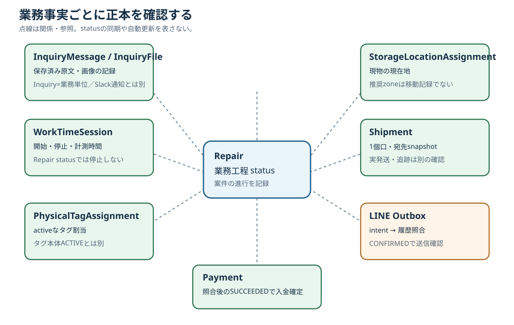

# 第35章 ステータスと正本データの考え方

## 35.1 「正本」は業務事実ごとに決まる

一つの巨大なstatusが、問い合わせ、修理、現物の位置、発送、連絡、入金をすべて表すわけではない。本章の**正本**とは、その業務事実を確定する根拠である。「DBにあるtableなら何でも正本」という意味ではない。候補、通知、送信待ち、画面表示は、対応する事実が確定した証拠とは限らない。

図の線は案件との**関係・参照**を示す。同じstatusへの同期矢印ではない。保守時は「何を確定したいか」を先に決め、その事実の記録と確定条件を確認する。

## 35.2 事実と確認先

| 確認したい事実 | 確認先と境界 |
| --- | --- |
| LINE問い合わせの本文・受信画像 | 保存済み`InquiryMessage`の原文と`InquiryFile`の保存状態。画像本体はR2。`Inquiry`は問い合わせの業務単位。AI分析やSlack本文では代用しない |
| 案件の業務工程 | `Repair.status`。status変更は他の業務事実の自動確定を意味しない |
| 計測中・計測済みの作業時間 | `WorkTimeSession`の開始・終了とactive状態。`Repair.status`を`作業完了`にしてもタイマーは自動停止しない |
| 現物の保管場所 | activeな`StorageLocationAssignment`と参照先`StorageLocation`。推奨zoneはread-onlyの案内で、実移動記録ではない |
| タグ本体が使用可能か／案件に付いているか | `PhysicalTag.status`とactiveな`PhysicalTagAssignment`を別々に確認。割当をreleaseしてもタグ本体は`ACTIVE`のまま再利用できる |
| 1個口の宛先 | `Shipment`作成時のdestination snapshot。Customerの現住所が後で変わっても、既存Shipmentの宛先をそこから補わない |
| 発送計画・実発送・追跡 | `Shipment.status`、`actualShippedAt`、`trackingNumber`等を各々確認。`Repair.status`との同一視や、status名だけによる配送会社の引受判定をしない |
| LINE送信の確認 | `LineManagerSendOutbox`の`CONFIRMED`とManager履歴の照合。`APPROVED`はintent、`POST_UNCONFIRMED`は結果未確定。確認後に`OUTBOUND InquiryMessage`を作る |
| カード入金の確定 | 署名付きStripe Webhookでpaid Sessionと登録済みAttempt等を照合した後の`Payment.status=SUCCEEDED`。success画面やWebhook到着だけでは確定しない |

### 問い合わせとSlack

LINE Webhookの成功応答は`LineWebhookInbox`への受信保存を表す。後続の`InquiryMessage`／画像保存とSlack投稿は別段階である。`SlackNotificationOutbox`は通知の送達管理であり、Slackの表示・未着を問い合わせ原文の有無と読み替えない。画像は`InquiryFile.uploadStatus=STORED`まで確認する。詳細は[第6章](06_inquiry-line-storage.md)、[第27章](27_line-webhook.md)、[第30章](30_slack.md)。

### Repairと現物・時間

案件が`作業完了`でもactiveなタイマーが残り得るため、終了時は別に停止する。保管場所の推奨が変わっても現物とassignmentは自動移動しない。タグの割当解放はタグ本体の廃止でもShipmentの発送確定でもない。詳細は[第13章](13_work-time-session.md)、[第16章](16_physical-tag.md)、[第18章](18_storage-location.md)、[第20章](20_completion-line.md)、[第24章](24_physical-tag-release.md)。

### Shipmentと外部配送

Shipmentは1個口の記録で、Repairとは別に作成する。作成・梱包一致・タグrelease・ゆうプリR向けCSV出力のいずれも、それだけで実発送にならない。現行のゆうプリR発送履歴APIは**read-only preview**で、tracking候補、raw日付値・status codeを保存しない。Task202Bで公式配送status codeの組の説明を表示できるが、説明はShipment状態の確定ではない。`10/0A`も「引受予定」であり実引受ではない。14バイトの日付値のparseと、追跡番号・発送／配達状態の書戻しは未実装である。詳細は[第22章](22_shipment.md)、[第23章](23_shipment-packing.md)、[第25章](25_yupuri.md)。

### 送信と決済

LINEの画面操作は送信待ちintentを作る。senderのPOST試行後も、Manager履歴を厳密に照合して`CONFIRMED`になるまで「送信済み」としない。StripeもCheckoutのsuccess URL表示と署名検証済みWebhookの到着を、無条件に支払確定としない。paid条件と登録情報の照合が成立し、`Payment`と`PaymentAttempt`が`SUCCEEDED`になった状態を確認する。詳細は[第28章](28_line-manager-sender.md)、[第34章](34_external-integrations.md)。

## 35.3 不明な値を別のstatusで埋めない

未知の配送code、追跡候補の競合、曖昧なLINE履歴、未確認の送信先、決済情報の不一致などは、根拠が揃うまで**要確認／fail closed**とする。「多分発送済み」「多分未送信」と推測して次のstatusへ進めない。障害の調査では、各段階の保存記録、外部側の証拠、担当者の確認結果を分けて記録する。二重処理を避ける判断は[第36章](36_duplicate-safety.md)を参照する。
