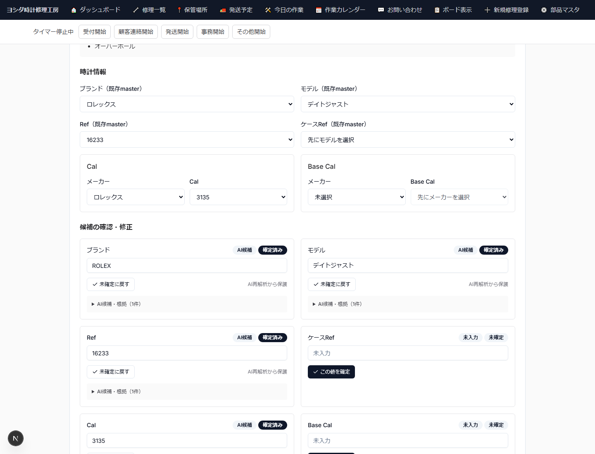

# 受付編 印刷レイアウト見本

版: 0.1
作成日: 2026-10-04

このファイルは、詳細版・簡易版で共用する画面素材を使ったA4カラー印刷レイアウトの初期見本である。
最終本文の正本ではなく、ページ密度・文字サイズ・スクリーンショットの大きさ・注意枠の見え方を確認するためのプレビューとして扱う。

> 掲載画面は実アプリのコンポーネントを使い、表示データだけをマニュアル用の合成データへ差し替えて撮影している。実顧客の個人情報・LINE識別子・認証情報は使用しない。

## 1. LINE問い合わせを確認する

1. 管理画面の「お問い合わせ」から対象Inquiryを開く。
2. LINE履歴を時系列で確認する。
3. `送信待ち` は実送信確認済みではないことに注意する。


**重要:** Slackは通知チャネルであり、問い合わせ本文の正本ではない。正本はSupabaseに保存されたInquiry / InquiryMessage / InquiryFileである。

## 2. AI候補を確認・確定する

1. ブランド / モデル / Ref / Cal等の既存master候補を確認する。
2. AI候補の確信度と根拠を確認する。
3. 正しい値だけを人が確定する。
4. 未確認情報は無理に確定せず、現物確認へ残す。



**重要:** AI候補は正式値ではない。人が確定した値はAI再解析から保護される。

## 3. 受付希望と受付リンク

1. 受付する時計を「受付希望」にする。
2. 「お客様用受付リンクを発行」を押す。
3. URLとLINE案内文を確認して送る。
4. 顧客が入力を完了するとWatch / Repairが作成され、Repairはまず`送付待ち`になる。


**重要:** 受付リンクのtokenは推測困難なbearer情報として扱い、マニュアルでは実tokenを掲載しない。

## 4. 内部処理の要点

```text
顧客LINE
  ↓
LINE Webhook
  ↓ 署名検証
Railway / Next.js
  ↓
LineWebhookInbox
  ↓ n8nが1分間隔で後処理
Inquiry / InquiryMessage / InquiryFile
  ├─ 画像 → Cloudflare R2
  └─ Slack通知Outbox → n8n → Slack
  ↓
AI解析はinquiry-ai-bridge経由で明示実行
  ↓
人が受付レビュー
  ↓
受付リンク
  ↓
顧客入力
  ↓
Watch / Repair作成 → 送付待ち
  ↓
現物到着 → 受付
```

- n8n自身を案件データの正本にはしない。
- n8nがAI解析を行う構成ではない。
- LINE通常トーク送信はn8nから直接行わない。
- 重要な正式値は人の確認を残す。
