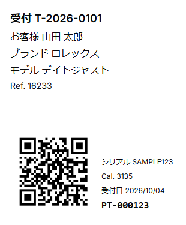

# 受付編 続き — 現物受付・管理タグ・保管場所

版: 0.1
作成日: 2026-10-04

前半の「LINE問い合わせ → AI受付レビュー → 受付リンク → 送付待ち」に続く、現物到着後の印刷レイアウト見本。
画面例は実顧客データを使わず、現在のアプリUI・レイアウトをマニュアル用合成データで再現している。

## 5. 現物が到着したら「受付」へ進める

顧客が受付フォームを送信した時点でRepairは作成済みだが、最初のstatusは `送付待ち` である。
時計が工房へ実際に届いてから `受付` へ進める。

```text
顧客が受付フォーム送信
  ↓
Repair = 送付待ち
  ↓
顧客が時計を発送
  ↓
工房へ現物到着
  ↓
顧客 / 時計 / 受付番号を照合
  ↓
Repair = 受付
```

**重要:** Repairが存在することと、時計現物を受領済みであることは同じではない。現物到着前に `受付` へ変更しない。


<div style="page-break-before: always;"></div>

## 6. PhysicalTagを確認する

現物受付後、Repair詳細の「PhysicalTag / 管理タグ」で時計現物とデジタルRepairを結び付ける。


- `PT-000123` のようなshortCodeは人が読める管理番号。
- NFC UIDは通常scan用の検索キー。秘密鍵や認証情報ではない。
- QRは推測困難なopaque tokenを使用する。
- NFC UIDを使わない場合でもQR + shortCodeで発行できる。

**重要:** QR payloadへ顧客名、住所、Repair ID、受付番号等を直接入れない。

<div style="page-break-before: always;"></div>

## 7. Brother QL-800で修理袋ラベルを印刷する

Repair詳細の「ラベル印刷」から、DK-2205 62 mm連続紙用の **62 × 75 mm** ラベルをBrother QL-800へb-PACで直接印刷する。「プレビュー」からPDFも開ける。



印刷時の基本:

1. QL-800のonline状態とDK-2205の62 mm連続紙を確認する。
2. 「ラベル印刷」を押す。印刷先はQL-800に固定され、b-PAC Extension・用紙・テンプレートの確認に失敗した場合は印刷しない。
3. 75 mmでオートカットされたことを確認する。
4. 受付番号・時計情報・shortCodeを目視確認する。
5. 必要に応じてQR scannerで読取確認する。

PDFを確認・予備印刷する場合は「プレビュー」から開き、62 × 75 mmを等倍で印刷する。再印刷で新しいPhysicalTagは発行しない。

**運用:** DK-2205は糊付きだが、剥離紙から剥がさず台紙付きのまま修理袋用カードとして扱う。

<div style="page-break-before: always;"></div>

## 8. StorageLocationを登録する

時計を実際の保管ゾーンへ置いた後、アプリ上の現在地を一致させる。


`受付` のRepairは通常 `受付処理待ち` が推奨ゾーンになる。

確認する項目:

- 現在の保管場所
- 管理コード
- 所属ゾーン
- 推奨 / 許容ゾーン
- 判定
- 根拠

**重要:** 推奨ゾーンは自動移動ではない。現物を実際に移動し、人が確認した後でStorageLocationを記録する。

## 9. 現物受付後の基本順序

```text
送付待ち
  ↓ 現物到着
受付
  ↓
PhysicalTag発行・割当
  ↓
QL-800で62 × 75 mmラベル印刷
  ↓
修理袋へ収納
  ↓
StorageLocation登録
  ↓
見積工程へ
```
