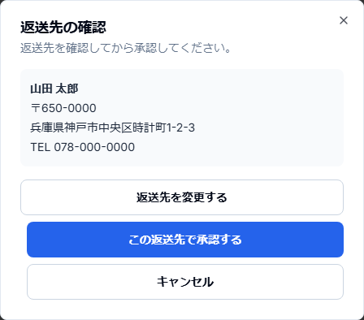

# 見積・承認・部品編 印刷レイアウト見本

版: 0.1
作成日: 2026-10-04

受付後の「見積作成 → 見積共有 → 顧客承認 → 部品発注」のA4カラー印刷レイアウト確認用原本。
実顧客の個人情報・実共有token・実発注データは使用しない。

## 1. 見積・修理明細を入力する

Repair詳細で、必要な技術料・外装修理技術料・交換部品を追加する。


確認する項目:

- 作業 / 部品名
- 仕入値
- 上代（税抜）
- 個数
- 部品Ref・在庫 / 発注状態
- お客様連絡
- 税込合計

**重要:** 見積へ部品を入れただけでは、B2C承認前の実在庫を案件へ引き当てない。

<div style="page-break-before: always;"></div>

## 2. 見積書PDFを生成・確認する

修理一覧で対象Repairを選択し「見積書作成」。見積書画面では保存済みPDFを生成して内容を確認する。


```text
Repair一覧で選択
  ↓
見積書作成
  ↓
PDFを生成
  ↓
PDFを開いて確認
  ↓
LINEで送信
```

管理画面と顧客共有ページは同じ保存済みPDFを参照する。

**重要:** LINEではPDF添付ではなく、顧客用共有ページURLを送る。

<div style="page-break-before: always;"></div>

## 3. LINE実送信確認後に「承認待ち」へ

```text
「LINEで送信」
  ↓
Outbox = APPROVED
  ↓
local sender / lineoa
  ↓
LINE Managerへ実送信
  ↓
送信履歴照合
  ↓
CONFIRMED
  ↓
Repair = 承認待ち
```

**重要:** 「LINEで送信」を押した直後の `APPROVED` は送信完了ではない。LINE Managerの送信履歴で確認できてから `承認待ち` へ進む。

## 4. 顧客が見積を確認する


顧客は時計情報・見積明細・合計・説明を確認し、「この内容で進める」またはLINE相談を選ぶ。

<div style="page-break-before: always;"></div>

## 5. 返送先を確認して承認する

B2Cでは承認直前に返送先を確認する。



住所が不足していれば入力・修正し、「この返送先で承認する」を押す。

承認後:

```text
approvalStatus = approved
approvalDate = 保存
  ↓
必要部品・在庫・発注状態を再計算
  ↓
部品待ち または 作業待ち
```

<div style="page-break-before: always;"></div>

## 6. 部品を発注・入荷・割当する


主な状態:

1. 発注リスト追加済み (`pending`)
2. 注文済み (`ordered`)
3. 入荷済み (`received`)
4. 案件へ割当 (`assigned`)

承認前の明示的な先行発注は可能だが、承認前B2C Repairへ部品を割り当てない。

`received` は「工房へ物理的に入荷した」、`assigned` は「そのRepair用に確保した」という別イベントである。

## 7. 見積・承認の状態を混ぜない

| イベント | 意味 |
| --- | --- |
| 見積明細保存 | 見積作業中 |
| 見積書作成 | EstimateDocumentを作成 |
| PDF生成 | 顧客提示用PDFを保存 |
| LINE Outbox APPROVED | 送信してよいintent |
| LINE CONFIRMED | 実送信確認済み |
| Repair承認待ち | 顧客回答待ち |
| approvalStatus approved | 顧客が正式承認 |
| OrderRequest received | 部品が工房へ入荷 |
| assigned | 部品を案件へ確保 |

この区別が、二重送信・承認前引当・重複発注を防ぐ基本になる。
