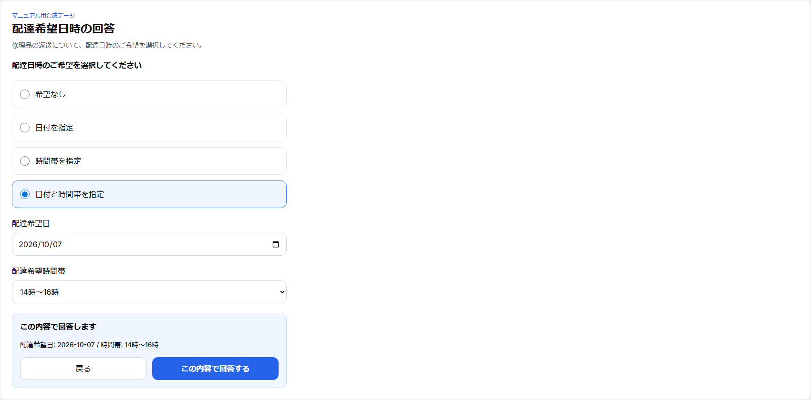
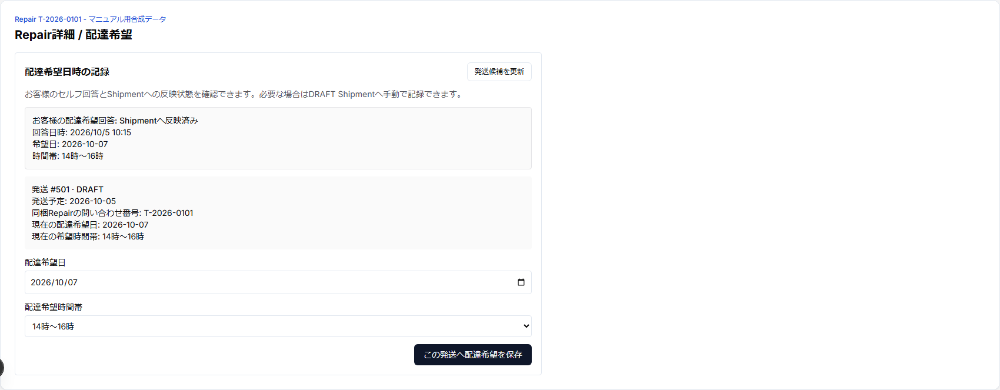
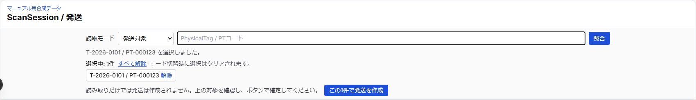
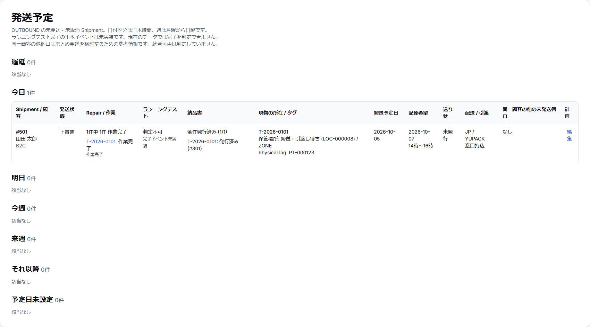
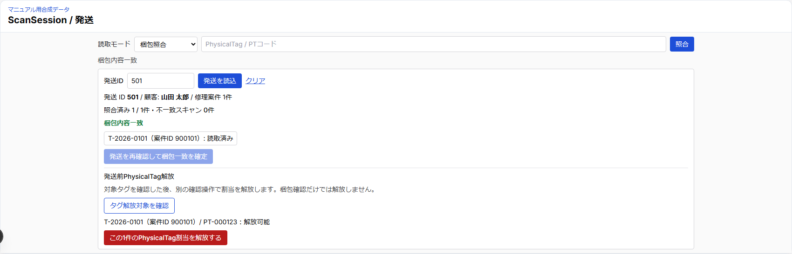

# 配達希望・発送・ゆうプリR編 印刷見本

版: 0.1
作成日: 2026-10-05

作業完了LINE後の「配達希望回答 → Shipment → 梱包照合 → PhysicalTag release → ゆうプリR」の印刷レイアウト見本。
画面例は実顧客・実Shipmentを使わず、実コンポーネントへマニュアル用合成データを表示している。

## 1. お客様が配達希望を回答する

お客様は `希望なし / 日付 / 時間帯 / 日付+時間帯` から選び、内容を確認して回答する。

回答はRepair単位で保存され、Shipment作成前でも保持できる。回答しただけでは発送・追跡は進まない。

## 2. Repair詳細でShipmentへの反映を確認する

`Shipmentへ反映済み` か、Shipment作成待ち・複数個口・同梱等で人の確認が必要かを区別する。
単一のDRAFT・未発送OUTBOUND Shipmentに当該Repairだけが入る場合に限り自動反映する。

## 3. PhysicalTagからShipmentを作る

ScanSessionを `発送対象` にし、同じ1個口へ入れるRepairを選択する。

**重要:** scanだけでは作成されない。対象を確認して `このN件で発送を作成` を押す。作成結果が通信断等で不明なら盲目的に再送しない。

## 4. 発送予定一覧で個口を確認する

`/shipments` はOUTBOUND・未発送・未取消の予定一覧。DRAFTだけ、発送予定日・配送会社・サービス・引渡方法・配達希望日・時間帯を編集できる。

ランニングテスト完了は専用イベント未実装のため `判定不可`。この一覧だけで発送済みとは判断しない。

## 5. 梱包照合とPhysicalTag release

`梱包照合` でShipment IDを読み込み、予定Repair全件をPhysicalTagで照合する。

全件一致・不一致0件で梱包一致を確認した後、別の明示操作でPhysicalTag割当をreleaseする。
releaseしてもPhysicalTag本体はACTIVEのまま再利用できる。梱包一致やreleaseだけではShipmentを発送済みにしない。

## 6. ゆうプリR V3 CSVの現行範囲

現行は認証済みAdmin API `GET /api/shipments/[id]/yupuri-v3` でCSVを出力する。`/shipments` に共通のCSV出力ボタンはまだない。出力対象は **OUTBOUND・`actualShippedAt = null` で、statusが `DRAFT / READY / LABEL_ISSUED / AWAITING_ACCEPTANCE` のいずれか** に限る。

| 項目 | 現行仕様 |
| --- | --- |
| フォーマット | 標準フォーマットV3 / 100列 / headerなし |
| 文字コード | CP932 / Shift_JIS / BOMなし |
| 行末 | CRLF |
| お客様側管理番号 | `SHP-{Shipment.id}` |
| 内容品 | 腕時計 |
| 荷物サイズ | 現時点では `060` 固定 |

CSV出力はread-onlyで、Shipment status、trackingNumber、実発送日時等を変更しない。

## 7. 発送履歴は現在read-only preview

`/shipments`の「ゆうプリR 発送履歴CSV」で1ファイルを選んでプレビューすると、追跡番号・Shipment状態の現在値と候補、公式code pairの説明、raw日付値、警告・エラーを比較できる。apply操作はなく、値は保存しない。`10/0A = 引受予定`は実際の郵便局引受を意味しない。`importableLater`は将来取込候補で、状態更新承認ではない。14バイトの日付値のparse・保存も未実装である。

**現在の限界:** 追跡番号保存、実引受検知、LINE発送通知、配達完了 → Repair納品完了の自動連携はまだ完成していない。
