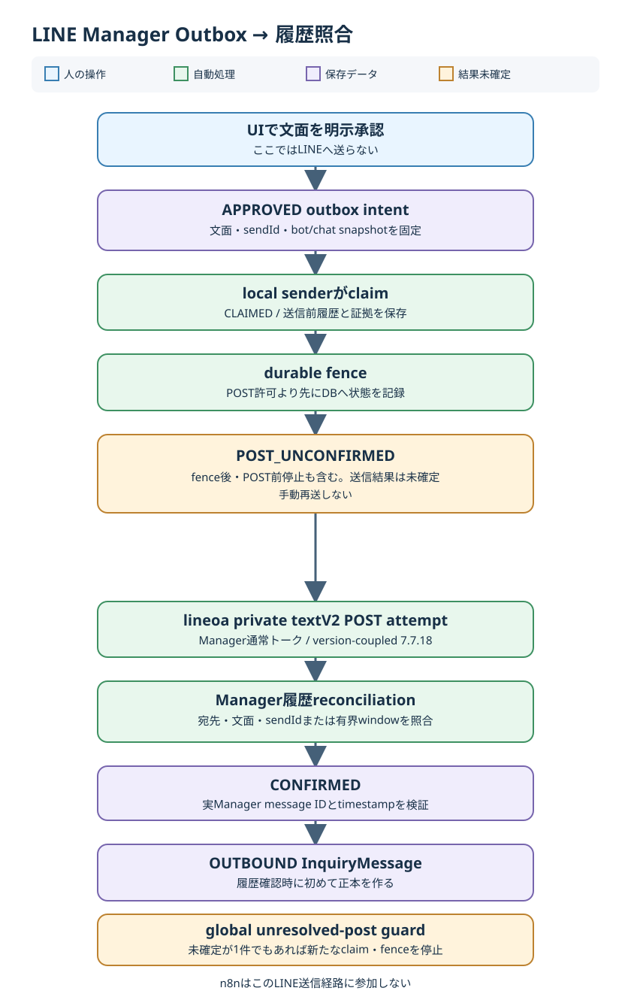

# LINE受信・Manager送信 内部構造編 印刷見本

版: 0.1

作成日: 2026-10-05

対象: 詳細版 第27・28章。A4縦カラー、全5ページ想定。図は本ファイルから共通SVGを参照する。画面例・識別子・認証情報は載せない。

## 1ページ目 — WebhookからInboxまで

**見出し:** LINE Webhookは、署名を検証してからイベントを保存する。

**図の下に置く要点:** `/api/line/webhook`はraw bodyの`x-line-signature`を検証する。成功応答は`LineWebhookInbox`への受信保存を示し、Inquiry処理やSlack投稿の完了を示さない。`webhookEventId`で同一イベントの重複保存を防ぐ。

**組版:** 図幅150mm。ページ下部に「受信保存 ≠ 業務処理完了」を短い注記として置く。

## 2ページ目 — claim、dedupe、正本

**見出し:** n8nは1分ごとに処理を起動し、正本化はアプリが行う。

| 確認点 | 現行の処理 |
| --- | --- |
| Inbox claim | 最大20件。`PROCESSING`が10分超なら再claim |
| 試行回数 | 最大5回。失敗時は`FAILED`と`lastError`を保持 |
| Message重複防止 | `InquiryMessage.externalMessageId`の完全一致 |
| Customer自動リンク | `Customer.lineId`完全一致が1件だけ |
| Inquiry競合 | 複数activeなら`NEEDS_REVIEW` |
| 画像 | `InquiryFile`のR2保存完了を確認してから`PROCESSED` |

**下段の注意枠:** `Inquiry`・`InquiryMessage`・`InquiryFile`が問い合わせの正本。Slackは通知。5回目の失敗は`INBOX_PROCESSING_FAILED`通知Outboxを作るが、受信イベントは消さない。

**組版:** 表のstatusは英字のまま統一し、注意枠は淡い琥珀色。

## 3ページ目 — 承認から結果未確定まで

**見出し:** UIの承認は送信intentの作成。送信確認は別工程。

**図の下に置く要点:** `APPROVED`作成時に文面・`sendId`・Manager送信先snapshotを固定する。local senderは`CLAIMED`後にdurable fenceを記録し、`POST_UNCONFIRMED`になってからlineoaのprivate `textV2` POSTを試みる。

**強調:** `POST_UNCONFIRMED`はPOST済み確定ではない。fence後・POST前停止もあり得るため、手動再送しない。

## 4ページ目 — 履歴照合と送信元の境界

**見出し:** 実際のManager履歴が一致してからOUTBOUNDを正本化する。

1. verified mappingは保存済みINBOUNDの`externalMessageId`とManager履歴の受信`message.id`の完全一致から作る。
2. reconciliationは固定送信先・完全一致の文面・`sendId`を照合する。履歴に`sendId`がなければ有界の時刻windowで一意の候補だけを認める。
3. 実Manager message ID・文面・送信先・timestampを検証して`CONFIRMED`にし、初めて`OUTBOUND InquiryMessage`を作る。

| 状況 | 扱い |
| --- | --- |
| `PRE_SEND_FAILED` | 1～4回目は30 / 60 / 120 / 300秒のbackoff。5回目は自動claim対象外 |
| `POST_UNCONFIRMED` | まずreconciliation。1件でもあればglobal guardで後続claim・fenceも停止 |
| 履歴が不一致・曖昧 | fail closed。送信済みを推測しない |

**脚注:** lineoa 7.7.18のprivate実装に依存する。Messaging API PushやLINE Manager公式公開APIの説明として使わない。n8nは送信しない。

## 5ページ目 — 障害時の確認順

**受信側:** Webhook応答 → `LineWebhookInbox` status / `attemptCount` / `lastError` → n8n実行 → `InquiryMessage`・`InquiryFile` → `SlackNotificationOutbox`。Slack未着のみで受信失敗と判断しない。

**送信側:** Scheduled Task state → Python worker → stdout / stderr → `APPROVED` / `PRE_SEND_FAILED` / `POST_UNCONFIRMED` / `CONFIRMED` → auth storage / session。`POST_UNCONFIRMED`があれば、そのreconciliationを先に解消する。

| 2026-10-05の稼働確認 | 値 |
| --- | --- |
| Scheduled Task | `ClockRepair-LineManagerSender`: Running / Enabled |
| runtime version | `3ac7067dad80d4463f9e897167cad46d270fb4ab` |
| poll | 既定30秒 |
| 確認結果 | stdoutでPOST試行から次cycleの履歴確認完了を1件確認。stderrは空 |

**注意枠:** 認証token、cookie、auth storage内容、顧客本文、実bot/chat/message IDを印刷・ログ転記しない。上記は当日時点の稼働記録であり、現在状態は運用時に再確認する。
