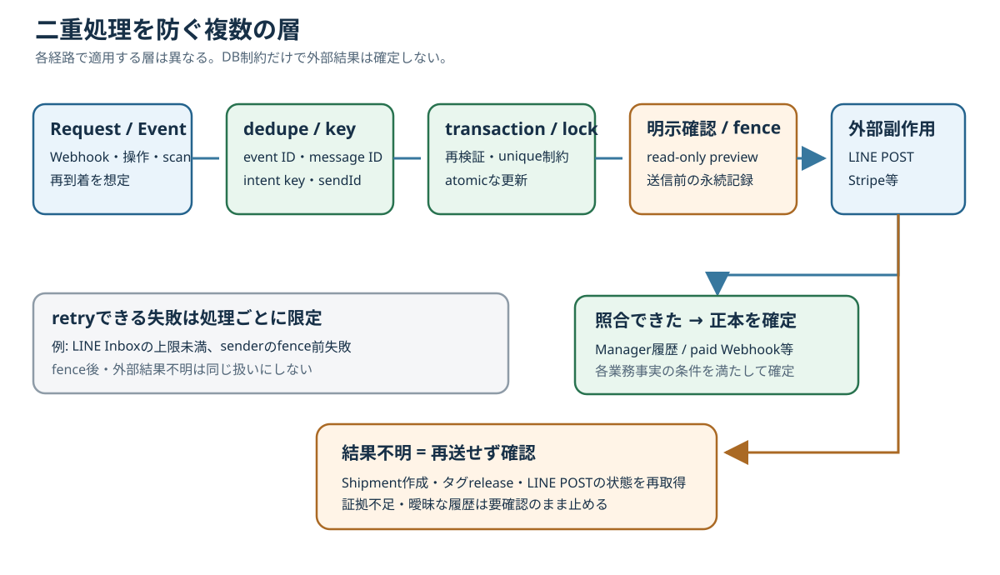

# ステータス・正本・二重処理防止編 印刷見本

版: 0.1

対象: 詳細版[第35章](../full/35_status-source-of-truth.md)・[第36章](../full/36_duplicate-safety.md)。**A4縦・カラー、全6ページ**。青＝業務の入口／処理、緑＝確定根拠、橙＝人の確認／結果不明、灰＝補足。図は175mm以内で配置し、文字が読める縮尺で印刷する。実顧客情報、実追跡番号、token、cookieは使わない。

## 1ページ目 — 正本データ全体図

**見出し:** 「何の事実か」で確認する記録が変わる。

**図下:** 線は関係・参照であり、同じstatusへ同期する意味ではない。「正本」はtable一般ではなく、その事実の確定根拠を指す。通知や候補値だけで確定しない。

## 2ページ目 — statusを混同してはいけない代表例

| 画面・記録で見えたこと | 別に確認する事実 |
| --- | --- |
| `Repair.status=作業完了` | `WorkTimeSession`の停止、現物の保管場所、LINE送信確認 |
| タグ本体が`ACTIVE` | active `PhysicalTagAssignment`がどのRepairに付くか |
| 推奨zoneが表示された | 実際のactive `StorageLocationAssignment`と現物 |
| Customerの住所を変更した | 既存Shipmentの宛先snapshot |
| Shipmentを作成・梱包一致した | 実発送日時、追跡番号、配送会社の引受 |
| LINE intentを作成・POSTを試行した | Manager履歴照合後の`CONFIRMED` |
| Stripe success画面へ戻った | 照合済み`Payment.status=SUCCEEDED` |
| ゆうプリR履歴をpreviewした | 実引受・配達完了。現行previewはread-only |

**注意枠:** ゆうプリRの`10/0A`は引受予定。実引受の確定ではない。未知code・証拠不足は要確認に留める。

## 3ページ目 — 二重処理防止の全体図

**見出し:** dedupe、再検証、確認、履歴照合を処理ごとに組み合わせる。

**図下:** unique制約やlockは並行更新を守る。外部POSTの結果不明を自動解決しない。read-only previewの後に人が対象を確認し、明示操作で更新する。

## 4ページ目 — LINE / Inquiry / Slackの安全柵

| 処理 | 重複判定の単位 | 確定の境界 |
| --- | --- | --- |
| LINE Webhook | `webhookEventId` | Inboxへの保存。Inquiry処理とは別 |
| InquiryMessage | `externalMessageId` | 保存済みLINEメッセージ。Webhook eventとは別のdedupe |
| Slack通知 | `dedupeKey` | 同じ通知intentを増やさない。問い合わせ原文はInquiry側 |
| LINE Manager | `idempotencyKey`、unique `sendId` | fence後は結果未確定。Manager履歴を照合して`CONFIRMED` |

**橙枠:** `PRE_SEND_FAILED`はfence前失敗として実装の条件で再試行できる。`POST_UNCONFIRMED`は未送信の意味ではなく、盲目的な再送は禁止。

見積LINEは見積書と送信条件のsnapshot由来のkey、作業完了LINEはRepair単位の固定keyを使う。どちらもintentの重複防止であり、送信済みの証拠は履歴照合である。[第27章](../full/27_line-webhook.md)・[第28章](../full/28_line-manager-sender.md)参照。

## 5ページ目 — Shipment / PhysicalTag / Stripeの安全柵

| 処理 | 人の確認・server再検証 | 結果が不明なとき |
| --- | --- | --- |
| Shipment作成 | scanで対象を選び、明示作成時にRepair・顧客・返送先snapshotを再検証 | 同じ選択の再confirmをblock。既存個口を調べる |
| PhysicalTag release | 梱包一致→read-only preview→明示POST。Shipment集合とactive割当を再検証しatomicに全件更新 | 同sessionから再POSTしない。割当を再取得する |
| Stripe | `PaymentAttempt` keyでSession作成。署名付きpaid WebhookをPayment行lock下で照合 | success画面やcomplete Sessionだけで入金にしない。`SUCCEEDED`を確認 |

**図下:** 梱包一致、タグrelease、ゆうプリR CSV出力は実発送の確定ではない。Stripe Webhookの再受信は、AttemptとPaymentがともに`SUCCEEDED`なら冪等に終了する。

## 6ページ目 — 障害時の判断表

| 見つかった状態 | 判断 | 次の確認 |
| --- | --- | --- |
| LINE Inbox `FAILED`・上限未満 | 条件付きretry可 | attempt数、画像保存、既存message ID |
| LINE sender `PRE_SEND_FAILED` | fence前の条件付きretry可 | backoffとclaim条件 |
| LINE sender `POST_UNCONFIRMED` | **再送禁止** | Manager履歴と固定宛先・文面・sendId |
| Shipment作成応答なし／ID不明 | **同じ選択を再送しない** | 発送一覧と既存個口 |
| Tag release応答不明 | **同sessionから再POSTしない** | active assignmentとShipment |
| Stripe Session complete・未確定 | **新規決済・手動確定を急がない** | Webhook、Attempt、Payment |
| ゆうプリRの未知code・重複候補 | **要確認** | raw CSV、照合先、実配送証拠 |

**保守担当への一文:** 確定根拠が足りない場合は、別statusへ進めず、保存済み記録と外部側の証拠を照合する。[第35章](../full/35_status-source-of-truth.md)・[第36章](../full/36_duplicate-safety.md)参照。
