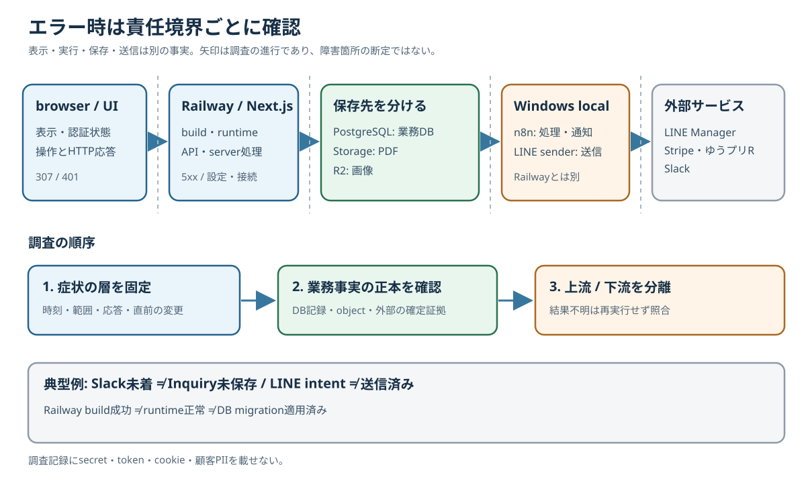
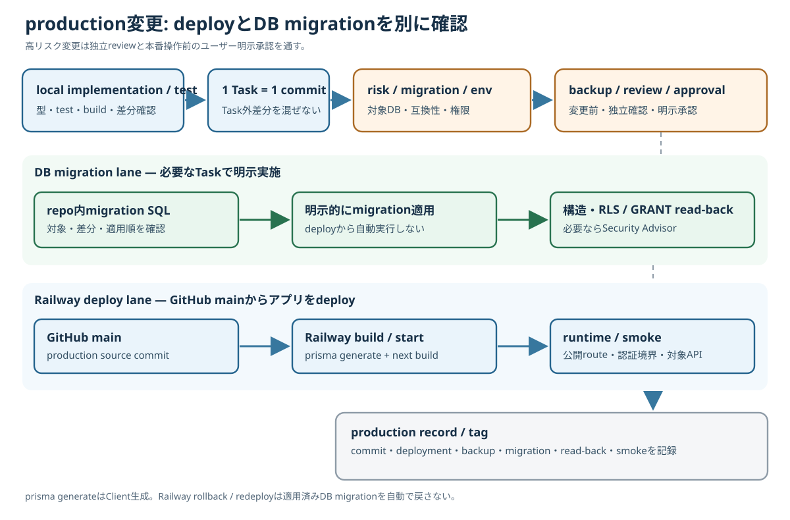

# 障害切り分け・production変更編 印刷見本

版: 0.1

対象: 詳細版[第37章](../full/37_troubleshooting.md)・[第38章](../full/38_backup-migration-deploy.md)。**A4縦・カラー、全6ページ**。青＝browser／アプリ・deploy、緑＝正本／DB確認、橙＝結果不明／承認、灰＝補足。図は175mm以内に配置し、本文は読みやすい縮尺を優先する。secret、token実値、cookie、顧客PII、実接続文字列は載せない。

## 1ページ目 — 障害切り分けの全体図

**見出し:** 症状の層を固定し、正本を確認してから上下流を分ける。

**図下:** 発生時刻・対象機能・影響範囲・HTTP応答・直前の変更を記録する。結果不明の操作は同じボタンを再実行しない。UI表示、DB保存、外部送信は別の事実。

## 2ページ目 — 症状別の最初の確認先

| 症状 | 最初に見る場所 | 次に見る場所 |
| --- | --- | --- |
| 保護画面`307`／API`401` | browserの認証状態とroute種別 | NextAuth境界。未認証時は正常な拒否の場合がある |
| `5xx`／runtime error | Railway runtime・HTTP log | 該当Next.js routeと依存先 |
| DB schema mismatch | Supabaseの稼働・対象構造 | repo内migration SQLと適用状態 |
| PDF missing | 文書記録・Storage `documents` | Storage操作・認証・object |
| 画像 missing | `InquiryFile.uploadStatus`または`RepairPhoto`行 | 用途別R2 object・read route |
| Slack未着 | Inbox・Inquiry・Slack Outboxを別々に確認 | n8n処理・Slack投稿結果 |

**橙枠:** Railway build成功はruntime正常やmigration適用済みの証拠ではない。Slack未着からInquiry未保存を推測しない。

## 3ページ目 — 結果不明と再試行禁止

| 状態 | 確認する正本・証拠 | 禁止する近道 |
| --- | --- | --- |
| LINE `APPROVED` | 送信intent。送信結果はManager履歴照合後の`CONFIRMED` | intentを送信済みとする |
| LINE `POST_UNCONFIRMED` | OutboxとManager履歴 | 未送信と決めて再送する |
| Shipment作成応答不明 | 発送一覧・既存個口 | 同じ選択を再confirmする |
| PhysicalTag release応答不明 | active assignmentとShipment | 同sessionから再POSTする |
| Stripe Session `complete`・未入金 | Webhook、Attempt、Payment | success画面だけで入金にする |
| ゆうプリR未知code | raw CSV・外部の実引受証拠 | 推測で発送済みにする |

**注意:** `10/0A`は引受予定。DB手動修正、再送、migration再適用を原因不明の第一手にしない。[第35章](../full/35_status-source-of-truth.md)・[第36章](../full/36_duplicate-safety.md)参照。

## 4ページ目 — production変更の安全フロー

**見出し:** local確認から記録まで、deployとDB migrationを別レーンで管理する。

**図下:** 1 Task = 1 commit。GitHub `main`からRailwayへdeploy。buildの`prisma generate`はClient生成でありmigrationではない。高リスク変更は独立reviewとユーザー明示承認を経る。

## 5ページ目 — migration / RLS / GRANT / backup

1. **適用前:** repo内migration SQL、対象production DB、未適用差分、互換性、実行権限を確認。
2. **変更前backup:** 時刻・対象・保存先・形式・復元可能性と限界を記録。migrationがあれば原則必須。
3. **高リスク:** schema／migration／RLS／GRANT／auth／決済／production DBは独立reviewと本番操作前の明示承認。
4. **適用後:** 構造、RLS／policy／GRANT／sequence権限をread-back。必要ならSecurity Advisor。

**緑枠:** 2026-10-30以降の新規`public` tableは、Data API利用時に同migrationでrole別の最小GRANTを明示。server-onlyには不要なGRANTを付けない。

**橙枠:** 2026-10-02のsecurity hardeningでは`pg_dump`不可のためlogical XML data + schema/security metadataをfallback取得し、以前のfull SQL dump baselineを保持した。fallbackを完全backupとみなさず、復元可能性を確認する。[Task記録](../../ai-tasks/supabase-security-hardening-20261002.md)参照。

## 6ページ目 — deploy / smoke / production記録

| 確認欄 | 記録する内容 |
| --- | --- |
| □ source | Taskのcommit、GitHub `main`のproduction source |
| □ Railway | deployment ID・結果、buildとruntimeを別々に確認 |
| □ DB | migrationの有無、適用結果、構造・権限read-back |
| □ backup | 保存先・取得時刻・対象・復元可能性／限界。不要なら理由 |
| □ smoke | 公開route、認証境界、変更対象APIの安全な応答 |
| □ 完了記録 | 未確認事項、production tag、Task記録 |

**橙枠:** 実顧客LINE送信、決済、DB破壊操作などを無断でsmokeしない。rollback／redeployはDB migrationを自動で戻さない。docs-only／investigation-onlyは`Production: pending`と明記する。
