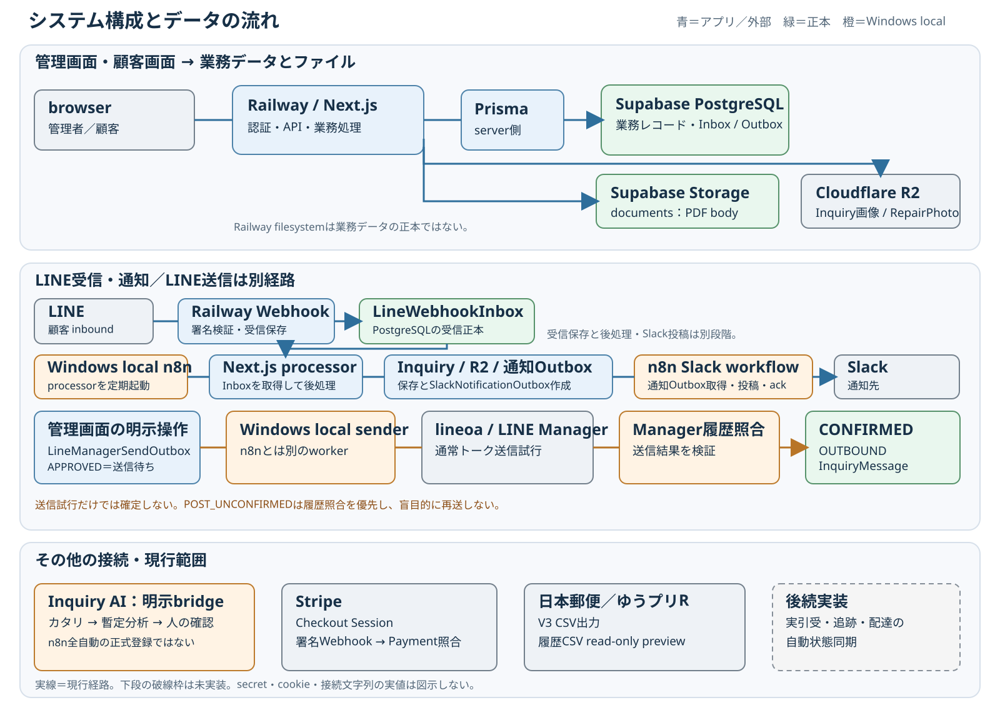

# システム構成・ログイン・共通操作編 印刷見本

版: 0.1

対象: 詳細版[第3章](../full/03_system-architecture.md)・[第4章](../full/04_login-common-ui.md)。**A4縦・カラー、全6ページ**。実顧客情報、実認証情報、token、cookie、接続文字列は載せない。

## 1ページ目 — システム構成とデータの流れ

**見出し:** 画面・保存先・Windowsローカル処理・外部サービスを分けて理解する。

**図下:** 実線は現行経路。ゆうプリRの実引受・追跡・配達完了の自動状態同期は未実装で、CSV出力・read-only previewと分ける。

## 2ページ目 — どこに何を保存するか

| 対象 | 正本・メタデータ | ファイル本体 / 外部役割 |
| --- | --- | --- |
| Customer / Inquiry / Repair / Shipment | Supabase PostgreSQL | 業務レコードの正本 |
| 見積・請求PDF | PostgreSQLの文書レコード | Supabase Storage `documents` |
| LINE Inquiry画像 | `InquiryFile` | Cloudflare R2。`uploadStatus=STORED`まで確認 |
| RepairPhoto | `RepairPhoto` | Cloudflare R2。InquiryFileのuploadStatusとは別 |
| Slack | 通知OutboxをPostgreSQLで管理 | 通知先。問い合わせの正本ではない |
| Railway filesystem / n8n実行履歴 | 一時処理・実行環境 | 業務データの正本にしない |

**注意:** DBに保存先情報があることと、ファイル本体を正常に読めることは別の事実。secret、object key実値、署名URLは印刷物へ載せない。

## 3ページ目 — 管理画面へのログイン

**見出し:** `/login` から管理者メールアドレスとパスワードでログインする。

- 認証はNextAuth Credentials。Adminのemailとpassword hashをserver側で照合する。
- session方式はJWT。成功後は `/repairs` へ移動する。
- `admin@example.com` は入力欄のplaceholderであり、実アカウントではない。
- 画面にボタンが見えることだけを操作権限の根拠にしない。

## 4ページ目 — ログイン後の共通レイアウト

**見出し:** 上段の3つの共通UIを確認してから各ページを操作する。

**図下:** 上部ナビは横スクロール可能で、現在のページは青。タイマーとscan receiverは各業務画面に共通する操作入口である。

## 5ページ目 — 上部ナビ・タイマー・scan receiver

**上部ナビ:** ダッシュボード、修理一覧、保管場所、発送予定、今日の作業、作業カレンダー、部品・発注・料金・請求・顧客・LINEユーザー等への入口。横スクロールでき、現在ページは青で表示される。

**WorkTimerBar:** activeな業務と経過時間を確認し、停止できる。停止中は「受付」「顧客連絡」「発送」「事務」「その他」をクイック開始できる。Repair固有タイマーと共通業務タイマーの対象を取り違えない。

**ScanReceiverBar:** 読取モードを先に選び、PhysicalTag / PTコードをscanまたは手入力する。保管場所移動・棚卸しではLocationタグ / LOCコードを先に指定する。scanは照合・選択が基本で、Shipment作成、タイマー開始、PhysicalTag解放、保管場所移動などの重要変更は別の明示確認を残す。

**原則:** 「読めた」ことと「確定した」ことを分ける。

## 6ページ目 — 共通操作の注意と現行制限

| 操作 | 確認すること |
| --- | --- |
| 保存 | アプリに記録されたか。外部送信・入金・発送完了とは別 |
| 確定・送信 | 対象と結果。後続の外部照合が残る場合がある |
| scan・照合 | 対象を識別・選択した段階か、別の確定操作が必要か |
| preview | read-onlyか。DBを更新しない確認画面か |

- 結果が分からないときは同じボタンを連打せず、一覧・詳細・正本状態を再確認する。
- toastは操作結果の手がかりだが、LINE送信、Stripe入金、日本郵便引受等の最終証拠とは分ける。
- 現行UIには**ログアウトボタン / `signOut` 操作がない**。画面からログアウトできるとは案内しない。共用PCでは認証済み画面を他者が操作できる状態で放置しない。
- 旧`/repairs/{id}` URL用QR listenerと、現行PhysicalTag / ScanSession運用を混同しない。

詳細: [第35章 正本データ](../full/35_status-source-of-truth.md) / [第36章 二重処理防止](../full/36_duplicate-safety.md)
