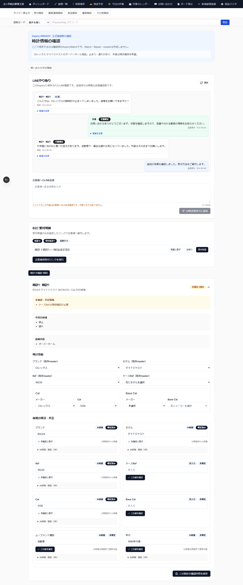
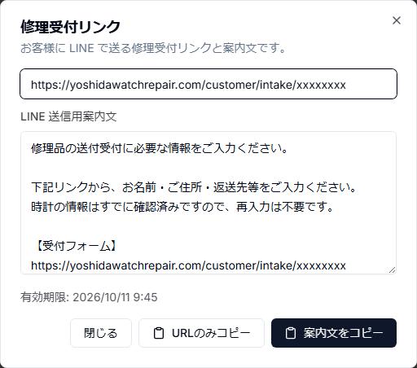
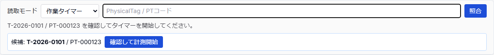

# 簡易版 1 — 受付から納品までの全体像

このページでは、1件のB2C修理をLINE問い合わせから返送・納品完了まで進める基本順序を示す。

## 1. LINE問い合わせを確認

Slackの通知またはInquiry一覧から新しい問い合わせを開き、保存済みの顧客メッセージ・画像を確認する。

## 2. 受付レビュー

Inquiryレビュー画面でLINE履歴とAIの暫定分析を確認する。

ブランド、モデル、Ref.、ケースRef、Cal.、故障内容、希望作業、不足情報等を確認する。AI候補はそのまま正式値にせず、人が確認する。

## 3. 時計情報を確定し、受付判断を行う

必要な時計情報を既存masterへ紐付け、不足しているmasterは内容を確認して明示登録する。

時計ごとに `受付希望 / 保留 / お断り` を選択する。

## 4. お客様用受付リンクを発行する

受付希望の時計について「お客様用受付リンクを発行」を押し、表示された案内文をLINEで送る。

受付リンクには、確認済みの対象時計が紐づいている。

## 5. 顧客入力後の「送付待ち」を確認する

顧客が受付ページで氏名・住所・返送先等を入力して送信すると、Customer / Watch / Repairが作成される。

この時点のRepairは **「送付待ち」**。時計現物を受領した状態ではない。

## 6. 時計が届いたら「受付」に変更する

現物が工房へ到着したら、対象Repairと時計を照合してstatusを `送付待ち → 受付` に変更する。

ここが工房での正式な現物受領操作になる。

## 7. PhysicalTagを発行する

修理袋用PhysicalTagをRepairへ割り当て、Brother QL-800でラベルを印刷する。

QR / NFC / shortCodeを使って時計現物とRepairを対応付ける。

## 8. 保管場所を登録する

時計を置いた箱・棚等のStorageLocationを登録し、アプリ上の現在地と現物の置き場所を一致させる。

## 9. 見積を作る

修理明細を入力し、価格・作業内容・必要部品を確認する。顧客へ提示する前に内容を最終確認する。

## 10. 顧客承認を確認する

顧客共有ページ等からの承認結果を確認する。部品発注や作業開始は、案件の承認条件に従う。

## 11. 部品準備・作業待ち

必要部品がある場合は発注し、揃うまでは部品待ちとして管理する。作業可能になった案件をScheduler / 今日の作業で確認する。

## 12. scanして作業開始

PhysicalTagをscanして対象Repairを確認し、必要な作業タイマーを開始する。scanだけで重要状態を自動確定しない。

## 13. 修理・ランニングテスト

作業を進め、タイマーを停止する。修理後は必要なランニングテスト・最終確認を行う。

## 14. 作業完了をLINE連絡

Repairが作業完了になった後、管理者が送信内容を確認し、「作業完了をLINE連絡」の明示操作を行う。ステータス変更だけでは自動送信しない。

## 15. 配達希望を確認

顧客がLINE内の案内から配達希望回答ページを開き、希望なし / 日付 / 時間帯 / 日付+時間帯を回答する。

## 16. Shipmentを準備

発送予定一覧で宛先、配達希望、対象Repair、PhysicalTag、保管場所等を確認する。

## 17. 梱包内容をscan照合

Shipmentに含まれるRepairのPhysicalTagを連続scanし、入れ忘れ・別案件混入・重複を確認する。全件一致後に最終確認する。

## 18. PhysicalTagをrelease

発送前に対象PhysicalTagを確認し、再利用可能な状態へreleaseする。

## 19. ゆうプリRへ出力

ShipmentからゆうプリR標準フォーマットV3 CSVを出力し、ゆうプリRで送り状を作成する。

## 20. 発送・配達完了を確認

現行アプリは、ゆうプリR向けCSV出力と発送履歴CSVのread-only previewまで対応している。送り状の発行・印刷、荷物の実引渡し、追跡、配達完了はゆうプリR / 日本郵便側で実際の結果を確認する。

発送履歴previewは追跡番号・実発送日時・配達完了日時・Shipment / Repair statusを書き戻さない。`10/0A = 引受予定`も実引受の証拠ではない。Task202B / Task204の実引受判定、追跡番号保存、LINE発送通知、配達完了からRepair納品済みへの自動連携は未完成のため、アプリに自動記録されたものとして扱わない。

---

実際の簡易版では、各工程を原則1ページに分け、画面画像へ番号・矢印・注意枠を入れる。
