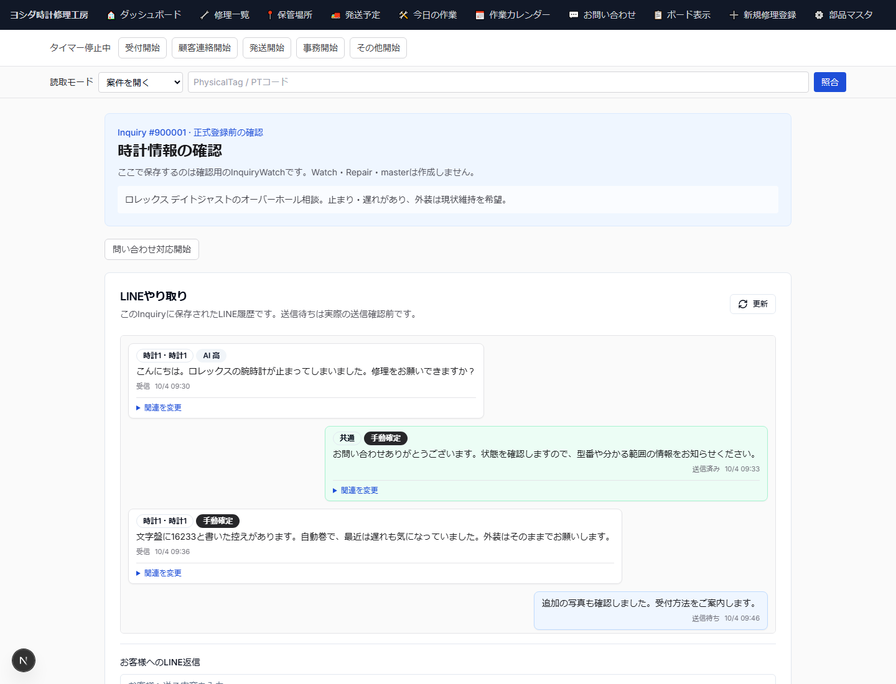

# 簡易版 2 — LINE問い合わせを確認する

## 目的

新しいLINE問い合わせを見つけ、正しいInquiryのレビュー画面を開く。

## 操作

1. Slackに新規問い合わせ通知が来たら、表示されているInquiry番号を確認する。
2. 管理画面のInquiry一覧を開く。
3. 対象Inquiryを開き、「時計情報の確認」画面へ進む。
4. 「LINEやり取り」で顧客の本文と画像を確認する。
5. 送信待ちの返信がある場合は、まだ送信済みとは判断しない。

## 画面で確認するところ

- Inquiry番号
- 顧客名またはLINE表示名
- LINE受信本文
- 受信画像
- メッセージの受信時刻
- 「送信待ち」と「送信済み」の違い

## 注意

**Slackは通知を見る場所であり、問い合わせ本文の正本ではない。**

内容の判断・LINE返信・受付判断は必ず管理画面のInquiryで行う。

LINE返信欄は内部メモではない。入力した内容は顧客向け送信内容として扱われる。
