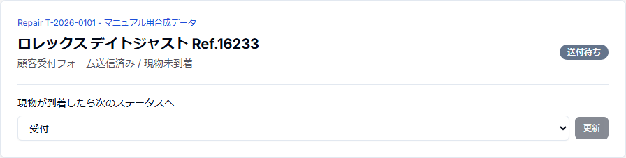
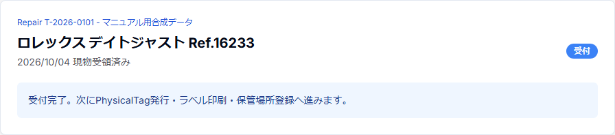

# 簡易版 4 — 「送付待ち」から現物受付へ

## 目的

顧客が受付フォームを送信した後にできたRepairを確認し、時計現物が到着したら「受付」へ進める。

## 1. 顧客の受付入力後

顧客が受付リンクから氏名・住所・返送先等を送信すると、対象時計ごとにWatch / Repairが作成される。

作成直後のRepair statusは **「送付待ち」**。

この状態は「受付情報は登録済みだが、時計現物はまだ工房へ届いていない」という意味である。

## 2. 現物が届くまで

Repairが「送付待ち」の間は、現物を受領済みとして扱わない。

顧客から発送連絡があっても、時計が実際に届くまでは「受付」へ変更しない。

## 3. 時計が到着したら

1. 荷物を開封する。
2. 顧客名・時計・Repair番号を照合する。
3. Repair一覧またはRepair詳細で対象案件を確認する。
4. statusを `送付待ち → 受付` に変更する。
5. 現物状態や同梱品等、必要な受付確認を行う。

「送付待ち」から選べる通常の次statusは「受付」である。

## 4. 受付後

現物受付が完了したら、次の順で現物管理へ進む。

1. PhysicalTagを発行・Repairへ割当
2. Brother QL-800で修理袋ラベルを印刷
3. 時計収納袋へラベルを付ける
4. StorageLocationを登録
5. 見積工程へ進む

## 注意

**Repairが存在することと、時計現物を受領済みであることは同じではない。**

`送付待ち` と `受付` を使い分け、現物の到着前に受付済みへ進めない。
