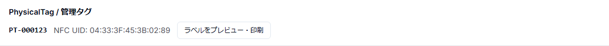

# 簡易版 4 — PhysicalTag発行と修理袋ラベル

## 目的

現物受付した時計へ管理タグを割り当て、Brother QL-800で修理袋ラベルを印刷する。

## 1. 現物受付を確認

Repairが `送付待ち` のままなら、時計現物を受領したことを確認して `受付` へ進める。

## 2. PhysicalTagを確認・発行

Repair詳細の「PhysicalTag / 管理タグ」を確認する。

- NFC UIDを使う場合はreaderで読み取った値を入力する。
- NFC UIDなしでもQR + shortCodeで発行できる。
- 発行後は `PT-000123` のようなshortCodeが表示される。

## 3. ラベルを印刷

1. 「ラベルをプレビュー・印刷」を押す。
2. 62 × 75 mm PDFを確認する。
3. Brother QL-800 + DK-2205へ等倍で印刷する。
4. 75 mmでオートカットされたことを確認する。
5. 受付番号・時計情報・shortCodeを目視確認する。

QRには顧客情報やRepair IDは直接入っていない。

## 4. 修理袋へ付ける

印刷物は剥離紙から剥がさず、台紙付きのまま修理袋用カードとして使用してよい。

時計本体へ直接タグやラベルを貼らない。

## 5. 次へ

PhysicalTagとラベルの確認後、時計を指定ゾーンへ置き、StorageLocationを登録する。
