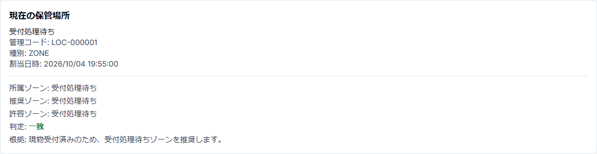

# 簡易版 5 — 保管場所を登録する

## 目的

時計現物を実際に置いた場所と、アプリ上のStorageLocationを一致させる。

## 1. 現物受付直後

`受付` のRepairは、通常 `受付処理待ち` が推奨ゾーンになる。

時計を修理袋へ入れた後、実際に `受付処理待ち` へ置く。

## 2. 現在の保管場所を確認

Repair詳細では、現在地と推奨ゾーンを確認できる。

確認する項目:

- 現在の保管場所
- 管理コード
- 推奨ゾーン
- 許容ゾーン
- 判定
- 根拠

## 3. 移動する場合

ScanSessionで `保管場所移動` を選ぶ。

1. 移動先Locationをscanする。
2. 時計側のPhysicalTagをscanする。
3. 複数本なら続けてscanする。
4. 対象Repair一覧を確認する。
5. 「この保管場所へ移動」を明示実行する。

scanだけでは保管場所は変更されない。

## 4. 不一致が出たら

「不一致」は、案件状態から推奨されるゾーンと、実際に登録されている保管場所が合っていない状態。

現物を確認し、正しい場所へ移動してからStorageLocationを更新する。statusを合わせるためだけに現物位置を自動変更しない。

## 5. 例外

置き場所を判断できない、タグ不良、案件情報と現物が一致しない等の場合は `要確認` を使用する。
