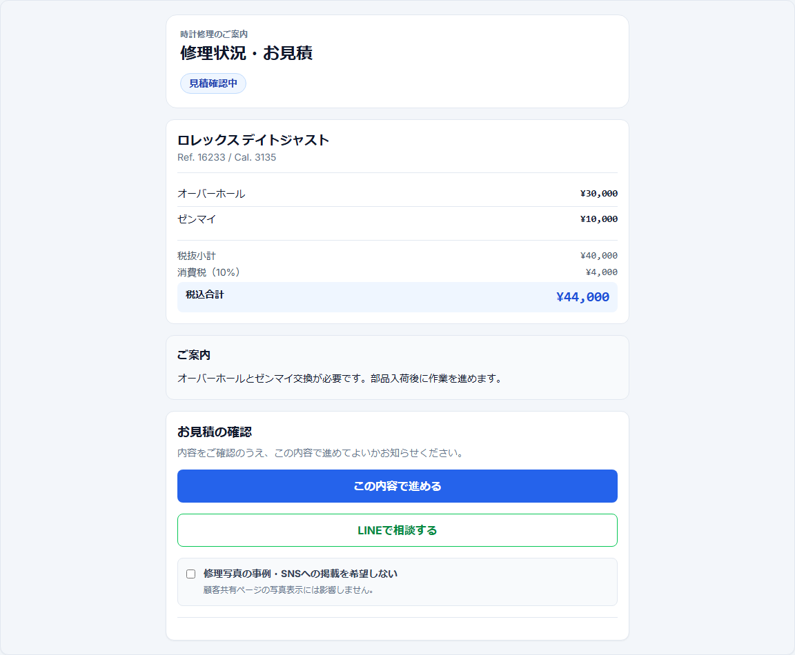

# 簡易版 8 — 顧客承認を確認する

## 目的

LINEで共有した見積を顧客に確認してもらい、承認後に部品・作業工程へ進める。

## 1. 承認待ちを確認

見積共有メッセージがLINEで実送信確認されると、対象Repairは `承認待ち` へ進む。

顧客共有ページでは、見積内容と「この内容で進める」が表示される。

## 2. 顧客が承認する場合

顧客は「この内容で進める」を押し、返送先を確認する。

住所が不足していれば入力・修正し、「この返送先で承認する」を押す。

承認後は `approvalStatus = approved` となり、部品状態が再計算される。

## 3. 承認後の次工程

- 部品不足なし → `作業待ち`
- 未注文部品あり → `部品待ち(未注文)`
- 注文済み部品あり → `部品待ち(注文済み)`
- 入荷済み・案件割当待ち → `部品入荷済み`

現物も実際の工程に合うStorageLocationへ移動する。

## 4. 修正・相談がある場合

B2C顧客は共有ページの「LINEで相談する」から内容変更を相談する。

相談を受けたら内容を確認して見積を修正し、PDFを再生成して確認したうえで最新版を再度LINEで案内する。

B2C共有ページには、現在「差戻し」ボタンは表示していない。

## 注意

「見積書を作った」「LINE送信ボタンを押した」「実送信確認できた」「顧客が承認した」は別の状態である。共有URLのtokenは他者へ公開しない。顧客操作用URLを作る際に、連番のRepair IDへ置き換えない。
