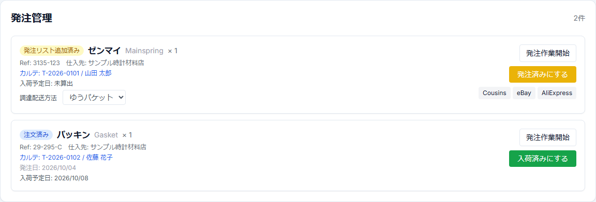

# 簡易版 9 — 部品を発注・入荷・案件割当する

## 目的

見積で必要になった部品を発注し、入荷後に対象Repairへ安全に割り当てる。

## 1. 必要部品を確認

交換部品行の検索から、時計のRef / Cal / 標準部品名に合うPartsMasterを確認する。

部品が不足していて発注が必要なら、発注リストへ追加する。

## 2. 承認前に先行発注する場合

必要なら顧客承認前でも明示的に発注依頼を作成できる。

ただし承認前は、

- 案件への在庫引当をしない
- Repairを部品待ちへ自動進行させない

という境界を維持する。

## 3. 発注管理を開く

発注管理画面で対象部品を確認する。

主な状態:

- 発注リスト追加済み
- 注文済み
- 入荷済み

## 4. 実際に注文したら

1. 必要なら調達配送方法を選択する。
2. 「発注済みにする」を押す。
3. 発注日・入荷予定日を確認する。

## 5. 部品が届いたら

「入荷済みにする」を押す。

入荷済みは「工房の物理在庫へ届いた」という意味で、まだ案件へ割当済みとは限らない。

## 6. 案件へ割当

顧客承認済みで、対象部品・数量を確認できたら「案件へ割当」を押す。

承認前B2C案件へは割当できない。

## 7. Repairの次status

部品の状態により、Repairは `部品待ち(未注文)` / `部品待ち(注文済み)` / `部品入荷済み` を経て、必要部品がすべて確保できれば `作業待ち` へ進む。
