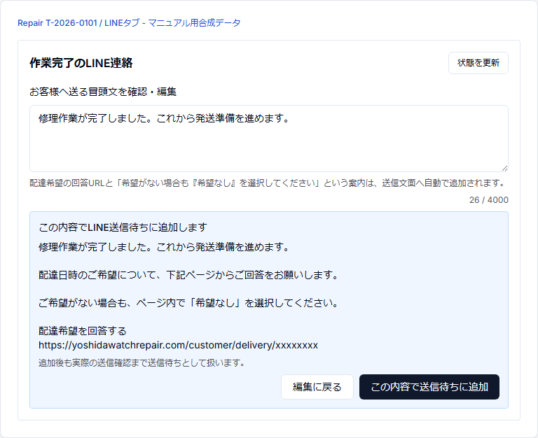
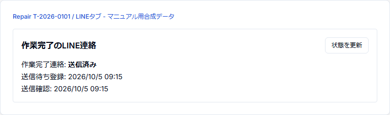

# 簡易版 17 — 作業完了をLINE連絡する

## 目的

ランニングテスト・最終確認後、B2Cのお客様へ修理完了と配達希望回答ページを安全に案内する。

## 1. LINEタブを開く

Repair詳細の `LINE` タブを開き、`作業完了のLINE連絡` を確認する。

Repair.statusが `作業完了` で、確認済みLINE送信先があるB2C案件が対象。

## 2. 冒頭文を確認

標準文:

`修理作業が完了しました。これから発送準備を進めます。`

必要なら冒頭文を編集する。

## 3. 送信内容を確認

`送信内容を確認` を押す。

配達希望回答URLと「希望がない場合も希望なしを選択してください」という案内が自動で追加される。

最終文面を読む。

## 4. 送信待ちへ追加

問題なければ `この内容で送信待ちに追加` を押す。

この時点はまだ `送信待ち` であり、送信済みとは限らない。

## 5. CONFIRMEDを確認

`状態を更新` し、最終的に次が表示されることを確認する。

- 作業完了連絡: `送信済み`
- 送信確認日時

## 注意

`送信結果の確認待ち` が出ている場合は再送しない。この状態はdurable fence後で実送信結果が未確定であり、既にPOST済みの可能性と、POST前に止まった可能性の両方があるため、状態確認を優先する。

LINE送信済みになっても、お客様の配達希望回答が完了したとは限らない。回答確認は次工程で行う。
